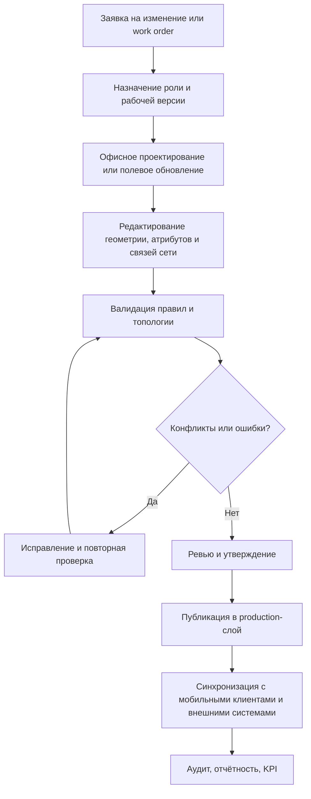

# Utility GIS editor

Отвечаю как архитектор корпоративных ГИС для инфраструктурных и коммунальных сетей, с фокусом на эксплуатационных цифровых двойниках и полевом редактировании.

## Executive summary

В исходном файле нет отдельной развёрнутой карточки Use Case под названием **Utility GIS editor**; ближайшее по смыслу и по набору признаков описание — сценарий для utility-оператора на базе ArcGIS Enterprise: офисные ГИС-специалисты, выездные бригады, branch versioning, reconcile/post, conflict resolution и синхронизация между полем и офисом. Поэтому ниже я реконструирую Use Case как **редактор авторитетной модели инженерной сети**, а не как обычный «веб-редактор карты». Это важное уточнение: здесь ядро продукта — не просто CRUD по геообъектам, а **топологически связанная модель сети**, версия данных, журнал изменений, согласование и эксплуатационные процессы. fileciteturn0file0

По аналогам рынок делится на несколько семейств. Самые близкие к этому Use Case — utility-native платформы и редакторы сетей: **Bentley OpenUtilities Designer**, **IQGeo Network Manager Electric**, **3‑GIS Web/Mobile/MIMS**, а в русскоязычном сегменте — прежде всего **Политерм ZuluGIS / ZuluGIS Online / ZuluGIS Mobile** и доменные модули **ZuluHydro / ZuluGaz / ZuluThermo**. Отдельный класс — GIS-centric asset lifecycle systems, такие как **Trimble Cityworks**, которые сильны в работе с активами, инспекциями и work orders, но обычно слабее в глубоком сетевом редактировании. Ещё один класс — облегчённые полевые и offline editors, например **Mappt** и экосистема **NextGIS**, которые особенно полезны как mobile-слой. citeturn53view0turn54view0turn20view0turn20view1turn20view2turn45view0turn49view0turn34view0turn34view3turn28view0

Главный вывод для продуктовой стратегии такой: если строить новый продукт под этот Use Case сегодня, то лучше целиться не в «ещё один web map editor», а в **hybrid utility editing platform** с тремя обязательными свойствами: **authoritative network model**, **field-office work execution**, **интеграция с EAM/ERP/OMS/ADMS/SCADA и документооборотом**. Именно эта связка повторяется у сильных аналогов в международном и русскоязычном сегментах. citeturn54view0turn53view0turn20view0turn20view2turn34view3turn45view0

## Как я интерпретировал Use Case

Файл описывает не продуктовую спецификацию, а набор сценариев коллективного редактирования пространственных данных. Для utility-сценария он фиксирует несколько ключевых сигналов: есть **разделение на офисных редакторов и field crews**, используется **branch versioning**, изменения **сливаются и публикуются** через reconcile/post, а поле и офис работают над одной корпоративной ГИС-моделью. Это и есть базовый каркас Use Case **Utility GIS editor**. fileciteturn0file0

Из этого следует, что Use Case нужно трактовать как систему для жизненного цикла инженерной сети — от проектирования и паспортизации до аварийных обновлений, инспекций и нормативной отчётности. В полном виде такой продукт должен уметь поддерживать **связанность сети, версионность, редактирование атрибутов и геометрии, офлайн-режим, привязку фото/документов, разграничение ролей, QA/QC, журнал изменений и интеграционный слой**. Такой набор прямо или косвенно подтверждается по аналогам: у Bentley есть embedded utilities GIS, workflow management и GIS integration; у IQGeo — live network model, offline-capable field/office app и коннекторы к GIS/OMS/ADMS/EAM/ERP; у 3‑GIS — full-editing GIS, mobile redlining, outage location и real-time sync; у ZuluGIS Online — редактирование графики и таблиц, линейно-узловая топология, гидравлические расчёты и AD-аутентификация. citeturn53view0turn54view0turn20view0turn20view1turn34view3

Ключевое допущение: поскольку в файле не дано точного домена сети, я рассматриваю Use Case как **кросс-утилитарный** — электрические сети, теплосети, водоснабжение, водоотведение, газораспределение, телеком и другие линейные сети. Это соответствует и файлу, где сценарии обсуждаются как шаблоны collaborative editing, и рыночной картине, где многие платформы покрывают сразу несколько utility-вертикалей. fileciteturn0file0 citeturn53view0turn54view0turn34view0

## Детализированное описание Use Case

### Цели и основные пользователи

Цель Use Case — поддерживать **единую авторитетную пространственно-топологическую модель сети**, в которой проектные, эксплуатационные и полевые изменения не конфликтуют друг с другом, а проходят через контролируемый жизненный цикл. Бизнес-ценность у такого решения обычно тройная: сокращение времени на актуализацию сети, уменьшение числа полевых/документальных ошибок и ускорение эксплуатационных решений при авариях, переключениях и инспекциях. Это ровно та логика, которую рыночные аналоги формулируют как live/adaptive network model, GIS-centric asset lifecycle, outage/inspection workflows и construction/as-built synchronization. citeturn54view0turn45view0turn20view2turn34view3

Основные пользователи — это не один «редактор карты», а несколько ролей. Во‑первых, **ГИС-редакторы и data stewards**: они ведут справочники, топологию, правила, шаблоны, слои, версии и публикации. Во‑вторых, **полевые бригады**: им нужно быстро находить активы, редактировать атрибуты и геометрию, прикладывать фото и синхронизироваться после офлайна. В‑третьих, **диспетчеры, эксплуатация и аварийные команды**: им нужны трассировки, отключающие устройства, связность, outage context и быстрые правки в реальном времени. В‑четвёртых, **инженеры-проектировщики и подрядчики**: им важны design/as-built циклы, work packages, cost feedback и контроль исполнения. В‑пятых, **ИТ и безопасники**: им нужны on-prem, права доступа, AD/SSO, аудит и управляемая интеграция. Этот набор ролей хорошо виден у IQGeo, Bentley, 3‑GIS, NextGIS и ZuluGIS. citeturn54view0turn53view0turn20view0turn20view1turn28view0turn34view3

### Базовые и продвинутые workflows

Нормальный «офисный» workflow выглядит так: редактор открывает актуальную версию сети, получает рабочее задание или change request, вносит геометрические и атрибутивные изменения, запускает валидации, проверяет топологию, отправляет изменения на review, после чего они публикуются в master/production. Именно поэтому в таком продукте обязательны versioning, snapshots/history, conflict resolution и роли approve/publish. В файле эта логика явно присутствует через branch versioning и reconcile/post; в рыночных системах её усиливают built-in version control в NextGIS, workflow management у Bentley и utility lifecycle workflows у IQGeo и 3‑GIS. fileciteturn0file0 citeturn28view0turn53view0turn54view0turn20view0

Полевой workflow иной: бригада скачивает район/работу/пулы активов на устройство, движется по маршруту, на месте уточняет координаты, статус, фотофиксацию, технические атрибуты, иногда — красные линии и схему подключения, а затем синхронизирует изменения обратно в корпоративную систему. Критично, что синхронизация должна поддерживать и **офлайн**, и **разрешение конфликтов**, а UI обязан быть адаптирован под «job-at-hand simplicity». Это явно подчёркивают 3‑GIS Mobile, IQGeo Network Manager Electric, Mappt и NextGIS field collection. citeturn20view1turn54view0turn49view0turn26view0

Для аварий и переключений нужен особый workflow: диспетчер или инженер определяет проблемный участок, трассирует связанность, находит отключающие устройства, оценивает downstream/upstream эффект, формирует оперативное задание полю, а после восстановления сеть и статусы работ синхронно обновляются. Это не просто карта, а **оперативная модель сети**. У ZuluGIS Online прямо заявлены анализ переключений, поиск отключающих устройств, кратчайший путь, связность и гидравлические расчёты; у Cityworks и 3‑GIS акцент сделан на inspections/work orders/field operations, а у IQGeo — на outage restoration, compliance и live network model. citeturn34view3turn45view0turn20view2turn54view0

Наконец, есть workflow проектирования и as-built: проектировщик подготавливает трассу или изменение сети, согласует с GIS-стандартами, передаёт в стройку/подряд, поле возвращает фактическое исполнение, и система либо частично, либо полностью обновляет authoritative network model. Здесь особенно сильны Bentley OpenUtilities, IQGeo и 3‑GIS. citeturn53view0turn54view0turn20view0



### Функции продукта

**Core-функции** для такого Use Case должны включать: векторное редактирование, формы атрибутов, вложения, поиск, фильтрацию, версионность, контроль доступа, историю изменений, веб-карту, desktop-клиент и mobile-клиент. Но для utility-сценария этого всё ещё недостаточно. Обязательны также **линейно-узловая топология**, трассировки, связность, правила создания объектов, шаблоны ввода, работа с инженерными типами активов и возможность быстро поддерживать «as exists in the real world»-модель. Это особенно явно видно у ZuluGIS/ZuluGIS Online, IQGeo Network Manager Electric и Autodesk Map 3D. citeturn34view0turn34view3turn54view0turn44view0

**Advanced-функции** отличаются тем, что ускоряют эксплуатационный цикл. По рыночным аналогам сюда входят: no-code/process digitization, dynamic cost estimation, work management, outage support, digital twin, визуальная AI-проверка фото и as-built, расчётные модули, кастомизация UI и embedded developer tooling. У Bentley это workflow engine, cost feedback и digital twin; у IQGeo — AI-powered workflows, adaptive network twin и системные коннекторы; у ZuluGIS Online — гидравлические расчёты, spatial filters и AD; у GeoMixer и NextGIS — API/SDK и встраиваемость. citeturn53view0turn54view0turn34view3turn36view0turn28view0

### Данные, форматы и интеграции

Для данных важны четыре слоя. Первый — **пространственные активы**: опоры, кабели, трубы, задвижки, колодцы, подстанции, камеры, трассы, участки и зоны обслуживания. Второй — **сетевая логика**: узлы, рёбра, связность, отключающие устройства, направления, режимы, допустимые связи. Третий — **эксплуатационный контекст**: work orders, inspections, incident/outage, статусы, подрядчики, SLA. Четвёртый — **документальный слой**: фото, PDF, чертежи, схемы, акты, паспорта. Такой многослойный состав хорошо согласуется с практиками 3‑GIS, Cityworks, IQGeo и ZuluGIS Online. citeturn20view0turn20view1turn20view2turn45view0turn54view0turn34view3

По форматам и интерфейсам хороший Utility GIS editor не может быть «замкнутым». Он должен поддерживать хотя бы часть из следующего стека: **PostgreSQL/PostGIS**, Oracle/SQL Server, CAD-форматы вроде DWG/DXF, shape/GeoJSON/KML, растры и тайлы, а также сервисные интерфейсы **WMS/WFS/WFS‑T/WMTS/OGC API/REST**. Это подтверждают Autodesk Map 3D, NextGIS Web, GeoMixer, ZuluGIS и GIS WebService SE от КБ «Панорама». citeturn44view0turn28view0turn36view0turn34view0turn26view3

Интеграции нужны минимум с четырьмя контурами. Первый — **корпоративные GIS/DB**; второй — **EAM/ERP/OMS/ADMS/CRM**, потому что одних геоданных для эксплуатации недостаточно; третий — **identity/security**: AD/SSO/RBAC; четвёртый — **field and document systems**. IQGeo прямо заявляет интеграции с GIS, CAD, ADMS, OMS, EAM и ERP; ZuluGIS Online — разграничение доступа и AD; NextGIS и GeoMixer — REST/API и интеграцию с БД/внешними Web GIS; Bentley — integration with common GIS systems и Work Management System. citeturn54view0turn34view3turn28view0turn36view0turn53view0

### Производительность, безопасность, UX, desktop/mobile/offline

Для производительности ключевы не только скорость рисования карты, но и скорость **валидации топологии, переключения между версиями, синхронизации, массового поиска, трассировок и выдачи work packages**. Для utility-клиента важно, чтобы продукт выдерживал глубоко связанные сети и большие наборы активов. Аналоги решают это по-разному: через embedded GIS/data models (Bentley), adaptive network twin и connected workflows (IQGeo), enterprise data/API (3‑GIS), либо кластеризацию/масштабирование и OGC-совместимость (GeoMixer, NextGIS, KB Panorama). citeturn53view0turn54view0turn20view0turn36view0turn28view0turn26view3

Для безопасности обязательны RBAC, журнал аудита, обратимая история изменений, on‑prem развёртывание, контроль прав на слои и объекты, а при российских внедрениях — возможность держать чувствительные данные внутри контура организации. NextGIS прямо подчёркивает flexible permissions и on‑prem deployment; ZuluGIS Online поддерживает логин/пароль и AD; GeoMixer и KB Panorama ориентированы на корпоративные/ведомственные внедрения; файл тоже задаёт enterprise-контекст, а не общественный crowdsourcing. citeturn28view0turn34view3turn36view0turn26view3 fileciteturn0file0

С точки зрения UX главный принцип — **role-based simplification**. GIS editor в офисе может быть сложным, но field app не должен требовать «GIS-мышления». У 3‑GIS MIMS, 3‑GIS Mobile, Mappt и ZuluGIS Online это фактически вынесено в value proposition: одномоментные рабочие формы, минимум обучения, redline/edit in field, offline-first или near real-time sync. Именно поэтому в продуктовой постановке нужно изначально различать **desktop power user**, **browser editor**, **mobile worker**. citeturn20view1turn20view2turn49view0turn34view3

### Бизнес-модели и метрики успеха

По рыночным аналогам видно пять устойчивых коммерческих моделей. Первая — **enterprise proprietary / contract sales**: Bentley, IQGeo, 3‑GIS, Cityworks, GeoMixer, Политерм, ИндорСофт. Вторая — **subscription/licensing per seat or per server**; Mappt прямо указывает цену от USD 29/мес., NextGIS сочетает cloud subscription и on‑prem editions. Третья — **module-based upsell**: domain modules, mobile, workflow, analytics, digital twin, AI validation. Четвёртая — **services-led revenue**: внедрение, обучение, data migration, custom integration. Пятая — **open-source + paid hosting/support/community services**: ярчайший пример здесь GISwater; в более мягкой форме — NextGIS. citeturn49view0turn26view0turn28view0turn14view2turn37view0turn36view0turn32view2

Для нового продукта я бы закладывал метрики успеха в четыре корзины. Первая — **качество данных**: доля топологических ошибок, среднее время публикации change set, процент записей с фото/документами, доля активов с полным mandatory-атрибутным набором. Вторая — **операционная эффективность**: время от полевого изменения до публикации, время подготовки outage/inspection work package, время поиска актива и маршрута бригады. Третья — **продуктовая adoption**: MAU офиса и поля, доля работ, закрытых без Excel/бумаги, процент офлайн-сессий, процент конфликтов при sync. Четвёртая — **коммерческая**: ARR/подписка, средний чек внедрения, attach rate на mobile+integration+analytics, стоимость миграции данных на одного заказчика. Это уже мои рекомендации, но они прямо вытекают из логики рынка и описанных аналогов. citeturn54view0turn45view0turn20view1turn20view2turn49view0

```mermaid
erDiagram
    ORGANIZATION ||--o{ USER : has
    USER }o--|| ROLE : assigned
    ORGANIZATION ||--o{ PROJECT : owns
    PROJECT ||--o{ VERSION : contains
    PROJECT ||--o{ LAYER : publishes
    LAYER ||--o{ ASSET : stores
    ASSET }o--|| ASSET_TYPE : typed_as
    ASSET ||--o{ ATTACHMENT : has
    ASSET ||--o{ INSPECTION : inspected_by
    ASSET ||--o{ WORK_ORDER_ITEM : involved_in
    NETWORK_NODE ||--o{ NETWORK_LINK : from
    NETWORK_NODE ||--o{ NETWORK_LINK : to
    ASSET ||--o| NETWORK_NODE : may_be
    ASSET ||--o| NETWORK_LINK : may_be
    WORK_ORDER ||--o{ WORK_ORDER_ITEM : contains
    USER ||--o{ EDIT_EVENT : performs
    VERSION ||--o{ EDIT_EVENT : records
    EXTERNAL_SYSTEM ||--o{ INTEGRATION_JOB : exchanges
    PROJECT ||--o{ INTEGRATION_JOB : triggers
```

## Международные аналоги, которых нет в файле

Ниже я сознательно исключаю решения, уже упомянутые в файле: **ArcGIS Online, ArcGIS Enterprise, Mergin Maps, QFieldCloud, HOT Tasking Manager + OSM, MapStore + GeoServer**. fileciteturn0file0

| Аналог | Страна | URL | Платформы | Что близко к Use Case | Уникальный дифференциатор | Лицензия / модель | Источники |
|---|---|---|---|---|---|---|---|
| **Bentley OpenUtilities Designer** | США | `bentley.com/software/openutilities-designer/` | Desktop, web/digital twin workflows | Проектирование и управление электрическими, газовыми, водными, wastewater и district energy сетями; встроенный utilities GIS; интеграция с common GIS systems; workflow engine; real-time cost feedback. Это один из самых близких enterprise-аналогов для design + authoritative editing. | Сильный мост между utility design, GIS и digital twin через iTwin/Bentley stack. | Проприетарное enterprise ПО, коммерческая модель через контакт/подписку. citeturn53view0 | Официальная страница продукта. citeturn53view0 |
| **IQGeo Network Manager Electric** | Великобритания | `iqgeo.com/products/network-manager-electric` | Web, field, office, offline-capable | Live/adaptive network model, единое приложение для поля и офиса, offline/online, design/as-builts/inspections/outage/compliance, интеграции с GIS/CAD/ADMS/OMS/EAM/ERP. | Выраженная концепция **geospatial work execution** и AI-powered network twin, а не только GIS-редактирование. | Проприетарное enterprise ПО, demo/trial + корпоративные продажи. citeturn54view0 | Официальная страница продукта. citeturn54view0 |
| **3‑GIS Web / Mobile / MIMS** | США | `3-gis.com/software/3-gis-web` | Web, iOS, Android, Windows | Full-editing GIS, browser access, project tracking, enterprise APIs, CAD context, outage support, field redlining, splice/panel reports, inspections and utility workflows. Очень сильный аналог для telecom/fiber и смежных utility-процессов. | Редкая глубина в telecom/fiber inventory + field execution; у MIMS — utility inspections и work orders без тяжёлого UI. | Проприетарное коммерческое ПО. citeturn20view0turn20view1turn20view2 | Официальные страницы 3‑GIS Web, Mobile, MIMS. citeturn20view0turn20view1turn20view2 |
| **Autodesk Map 3D Toolset** | США | `autodesk.com/products/autocad-map-3d/overview` | Desktop | Напрямую редактирует geospatial data, работает с FDO, поддерживает enterprise geodatabases, строит topology, умеет Enterprise Industry Models. Хороший аналог, если у заказчика сильна CAD-культура и нужен быстрый GIS/CAD bridge. | Наиболее удобен там, где нужно «втащить» GIS в AutoCAD‑центричный процесс и не ломать инженерские привычки. | Коммерческий toolset, входит в AutoCAD; free trial/pricing. citeturn44view0 | Официальная страница Autodesk. citeturn44view0 |
| **Trimble Cityworks** | США | `cityworks.com` | Web, tablet/field | GIS-centric asset lifecycle management для utilities, public works и airports; inspections, field operations, work orders, network management, map-based crew/resource assignment. Как Utility GIS editor — это скорее соседний слой эксплуатации поверх authoritative GIS. | Сильнее в asset/work management и эксплуатационных процессах, чем в глубоких схемотехнических сетевых редакторах. | Проприетарное коммерческое ПО, demo/brochure/contact sales. citeturn45view0 | Официальная страница продукта. citeturn45view0 |
| **GISwater** | Испания | `giswater.org` | Desktop/Web ecosystem, community/integration-driven | Открытая платформа для водоснабжения и дренажа: design, master planning, simulations, utility operations, интеграции с ERP/CRM/billing/incidents, free download, open source. | Самый сильный open-source аналог именно в water/wastewater utility domain. | 100% open source, бесплатная, коммерциализация через ассоциацию и сертифицированных интеграторов. citeturn14view2 | Официальная страница GISwater. citeturn14view2 |
| **Mappt** | Австралия | `mappt.com.au` | Android mobile, iOS family | Offline-first mobile GIS для utilities, data collection, WMS/WFS, geotagged photos, GPS tracking, quick forms, minimal training. Ближе к mobile execution layer, чем к полной authoritative utility platform. | Сильный lightweight mobile/offline сценарий без vendor lock-in; хорошо подходит как исходный референс для field UX. | Коммерческая подписка; лицензии от USD 29/мес. citeturn49view0 | Официальная страница продукта. citeturn49view0 |
| **OSPInsight / IQGeo Network Manager Telecom** | США / Великобритания | `iqgeo.com/products/ospinsight` | Web/telecom network management stack | Для telco/fiber use case: plan, design, build, analyze, maintain; migration path к более широкому IQGeo stack. Это релевантный аналог, если Use Case распространяется на операторские или ведомственные линейные сети связи. | Сильная наследственность именно в fiber OSP network management и migration path для существующих операторов. | Проприетарная коммерческая модель, trial/demo. citeturn21view0turn21view1 | Официальные страницы OSPInsight и Network Manager Telecom. citeturn21view0turn21view1 |

### Что видно по международному рынку

По международным аналогам хорошо видно, что «настоящий» Utility GIS editor обычно растёт в одну из трёх сторон. Либо он становится **network design + digital twin** платформой, как Bentley и IQGeo. Либо он становится **asset/work execution** платформой, как Cityworks. Либо он уходит в **field/offline specialization**, как Mappt и mobile-слои 3‑GIS. Открытый сегмент по-настоящему силён почти только в water/wastewater, где GISwater выглядит самым зрелым open-source ориентиром. citeturn53view0turn54view0turn45view0turn49view0turn20view1turn14view2

## Русскоязычный сегмент и аналоги, найденные в русскоязычном вебе

В русскоязычном сегменте рынок заметно более фрагментирован. Здесь чаще встречаются либо **коробочные GIS-платформы с возможностью донастроить utility-редактирование**, либо **специализированные отраслевые пакеты для тепла/воды/газа/энергосетей**, а не один универсальный продукт мирового типа «everything in one». Это особенно видно по Политерм, NextGIS, КБ «Панорама», СКАНЭКС и ИндорСофт. citeturn32view2turn28view0turn26view3turn36view0turn37view0

| Аналог                                                              | Страна / сегмент                         | URL                                      | Платформы                          | Что близко к Use Case                                                                                                                                                                                                                                                                               | Уникальный дифференциатор                                                                                            | Лицензия / модель                                                                                                                                                         | Источники                                                                 |
| ------------------------------------------------------------------- | ---------------------------------------- | ---------------------------------------- | ---------------------------------- | --------------------------------------------------------------------------------------------------------------------------------------------------------------------------------------------------------------------------------------------------------------------------------------------------- | -------------------------------------------------------------------------------------------------------------------- | ------------------------------------------------------------------------------------------------------------------------------------------------------------------------- | ------------------------------------------------------------------------- |
| **Политерм ZuluGIS + ZuluServer + ZuluGIS Online + ZuluGIS Mobile** | Россия                                   | `politerm.com/products/geo/zulugis/`     | Desktop, web, mobile               | ZuluGIS создаёт карты и схемы инженерных сетей с поддержкой топологии; Online умеет просмотр и редактирование графики и таблиц, топологические задачи, гидравлические расчёты, права доступа и AD; Mobile — мобильный клиент экосистемы. Это самый прямой русскоязычный аналог Use Case.            | Самое сильное сочетание «редактор сети + расчётная инженерная логика + web/mobile» в локальном сегменте.             | Коммерческая проприетарная линейка. citeturn34view0turn34view3turn33view1                                                                                            | Официальные страницы Политерм. citeturn34view0turn34view3turn33view1 |
| **Политерм ZuluHydro / ZuluGaz / ZuluThermo**                       | Россия                                   | `politerm.com`                           | Desktop/Web ecosystem              | Доменные модули для водоснабжения, газоснабжения и теплоснабжения: расчёты, резерв сети, утечки/дефекты, профили, схемы, модели сети. Это важно как профильная надстройка над редактором.                                                                                                           | Русскоязычная специализация на инженерных расчётах внутри той же GIS-экосистемы, а не отдельный анализатор.          | Коммерческие отраслевые модули. citeturn32view2turn33view3                                                                                                            | Официальный каталог продуктов Политерм. citeturn32view2turn33view3    |
| **NextGIS Web + QGIS Teamspace + NextGIS Mobile**                   | Россия / международный RUS‑friendly стек | `nextgis.com/nextgis-web/`               | Web, desktop/QGIS, mobile, server  | Центральная БД пространственных ресурсов, edit layers/services/maps, history/version control, flexible permissions, QGIS-centered collaboration, field collection online/offline, REST API, cloud or on-prem. Для многих российских команд это более лёгкий и гибкий вариант utility editing stack. | Лучший баланс между open-source, QGIS‑интеграцией, on‑prem и API/SDK; удобен для собственной сборки продукта.        | Open source + cloud subscription + on-prem editions. citeturn26view0turn28view0                                                                                       | Официальные страницы NextGIS. citeturn26view0turn28view0              |
| **КБ Панорама GIS WebServer SE + ГИС Сервер + GIS WebService SE**   | Россия                                   | `gisserver.ru`                           | Web, Windows, Linux, server stack  | Web-приложение для пространственных данных, удалённый доступ к картографическим данным, публикация по WMS/WMTS/WFS/WFS‑T/WCS. Это не «utility box» из коробки, но мощный локальный фундамент для корпоративного web‑редактора и публикации инженерных сетей.                                        | Сильная OGC-совместимость и локальная Windows/Linux серверная экосистема, удобная для гос- и корпоративных контуров. | На доступных страницах модель лицензирования не раскрыта детально; фактически это коммерческий product stack КБ «Панорама». citeturn26view3                            | Официальная витрина продуктов. citeturn26view3                         |
| **СКАНЭКС GeoMixer**                                                | Россия                                   | `scanex.ru/software/web/geomixer/`       | Web, mobile-capable, API/server    | Веб-картографическая интеграционная платформа: поддержка основных ГИС-форматов, поиск, запросы, редактирование векторных объектов, права доступа, API, интеграция с PostgreSQL/MS SQL, WMS/WFS, поддержка мобильных устройств.                                                                      | Сильная сторона — интеграционная платформа и быстрое встраивание GIS в внутренние системы предприятия.               | Коммерческое ПО, есть purchase/trial workflow. citeturn36view0                                                                                                         | Официальная страница GeoMixer. citeturn36view0                         |
| **ИндорСофт IndorPower + IndorMap + IndorField**                    | Россия                                   | `indorsoft.ru`                           | Desktop / field / enterprise stack | На уровне каталога продуктов видно: отдельный продукт для эксплуатации электросетей, отдельный модуль сбора полевых данных и универсальная ГИС. Это делает стек ИндорСофт интересным локальным аналогом, особенно для power utility.                                                                | Сильная локализация, продукты в реестре российского ПО, лицензии: пробная/учебная/коммерческая.                      | Коммерческая лицензируемая линейка. Доступные публичные страницы дают меньше product-detail, чем хотелось бы, но наличие целевой линейки подтверждено. citeturn37view0 | Официальный сайт ИндорСофт. citeturn37view0                            |
| **NextGIS ecosystem connectors: community, docs, GitHub**           | Россия / open-source ecosystem           | `docs.nextgis.com`, `github.com/nextgis` | Docs, GitHub, community            | Для русского сегмента это важно не как «ещё один продукт», а как показатель зрелости: документация, форум, GitHub и developer tooling уменьшают vendor lock-in и позволяют строить utility editor как platform-based solution.                                                                      | Самая заметная публичная открытая экосистема среди локальных GIS-поставщиков в доступных источниках.                 | Open-source ecosystem + коммерческие cloud/on-prem продукты. citeturn26view0turn28view3                                                                               | Официальный сайт и GitHub-организация. citeturn26view0turn28view3     |

### Что особенно важно в русскоязычном сегменте

Если смотреть именно на русскоязычный веб, то лучший «коробочный» референс под Utility GIS editor сегодня — это, на мой взгляд, **Политерм**: у него наиболее явная связка **топологический редактор + web/mobile клиенты + отраслевые расчёты**. Если же нужен более конструкторский и API-oriented путь, то самый сильный фундамент — **NextGIS**. Для enterprise web-GIS в гос- и крупнокорпоративных внедрениях важны **КБ Панорама** и **СКАНЭКС GeoMixer**. Для энергетики и локального compliance-сценария стоит держать в поле зрения **ИндорСофт**. citeturn34view0turn34view3turn28view0turn26view3turn36view0turn37view0

## Gap analysis и рекомендации по стратегии продукта

Файл хорошо покрывает **паттерны коллективного редактирования**, но не даёт полноценной модели самого Use Case. Он показывает, что для разных организаций нужны разные архитектуры — ArcGIS Online, Enterprise, QGIS-based cloud, OSM-community, open web-GIS — однако почти не раскрывает: модель ролей, data governance, структуру инженерных сущностей, топологические правила, offline conflict policy, аудит, security, интеграции с EAM/ERP/OMS/ADMS и коммерческий ландшафт, особенно в российском сегменте. В utility-сценарии файл особенно короток: он говорит о collaborative editing и versioning, но не разворачивает это в продуктовый blueprint. fileciteturn0file0

Из сравнительного анализа я бы выделил три главных разрыва между файлом и реальным рынком. Первый — **недостаточно utility-native аналогов**: в файле есть универсальные collaborative GIS tooling patterns, но почти нет специализированных продуктов уровня IQGeo, 3‑GIS, Bentley или Политерм. Второй — **недостаточно русскоязычного enterprise и utility-контекста**: в файле почти нет российских поставщиков и интеграционных стеков. Третий — **недостаточно бизнес- и эксплуатационных требований**: там нет чёткой постановки по work orders, inspections, outage workflows, нормативной отчётности, фотографиям/документам, а именно это отличает Utility GIS editor от generic web‑map editor. fileciteturn0file0 citeturn54view0turn20view2turn53view0turn34view3

Стратегически я бы рекомендовал позиционировать продукт не как «универсальный GIS editing tool», а как **Operational Utility GIS**. Упаковать его стоит вокруг трёх модулей. Первый — **Authoritative Network Editor**: versioning, topology, QA/QC, templates, approvals, publishing. Второй — **Field Work Execution**: offline mobile, inspections, photos, attachments, work packages, outage/damage/as-built. Третий — **Integration and Compliance Hub**: API, OGC/REST, EAM/ERP/OMS/ADMS, AD/SSO, audit, exports and reports. Такой скелет гораздо ближе к рынку и даёт более понятный ROI заказчику. citeturn54view0turn53view0turn20view1turn20view2turn28view0turn36view0

По технологической стратегии для СНГ и российского контура наиболее жизнеспособен **hybrid deployment**: on‑prem как базовый режим, web-клиент для большинства пользователей, desktop power client для сложного редактирования, mobile offline client для поля, PostgreSQL/PostGIS как предпочтительное ядро, открытые сервисные интерфейсы для обмена и отдельный lightweight integration layer. Такой подход лучше всего согласуется и с локальными ожиданиями по безопасности, и с практикой NextGIS / GeoMixer / KB Panorama / ZuluGIS. citeturn28view0turn36view0turn26view3turn34view0

По потенциальным партнёрам я бы предложил смотреть не только на вендоров, но и на роли в экосистеме. Для **GIS/platform** — NextGIS, КБ «Панорама», СКАНЭКС; для **utility domain logic** — Политерм; для **доступа к интеграторам и внедрению** — у Политерм есть сеть внедренческих организаций, у IQGeo — certified partner programs, у Bentley — partner ecosystem, у NextGIS — partnership layer. Иначе говоря, самый реалистичный выход на рынок — либо через отраслевых интеграторов, либо через ко‑брендированный platform/product partnership. citeturn32view2turn26view0turn36view0turn21view0turn50view0

## Open questions и ограничения

Самое важное ограничение — в доступном исходном файле Use Case **не размечен как отдельная карточка**, поэтому моя детализация — это осознанная реконструкция по ближайшему utility-сценарию из файла, а не пересказ готовой спецификации. fileciteturn0file0

Второе ограничение — для части известных мировых incumbents этого сегмента я не стал строить выводы без достаточно качественных официальных текущих страниц в доступном crawl. Сознательно лучше иметь чуть менее длинную, но более строгую выборку, чем «надуть» таблицу слабыми или старыми источниками.

Третье ограничение — русскоязычный сегмент публично показывает меньше продуктовых деталей, чем англоязычные вендоры. Поэтому по некоторым локальным игрокам лучше подтверждена **наличие линейки и тип платформы**, чем полная детализация feature-by-feature. Для product discovery этого уже достаточно, но для vendor due diligence всё равно потребуются демо, пилот и технический чек-лист.
