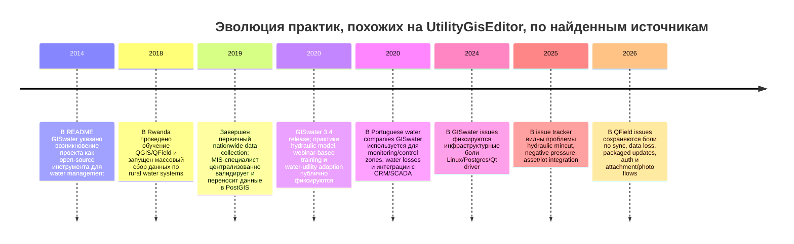

# Аналитический отчет по тому, как пользователи реально работают в роли UtilityGisEditor

## Executive summary

По содержанию загруженного описания роль **UtilityGisEditor** ближе не к «обычному редактору карты», а к **редактору авторитетной модели инженерной сети**: офисные редакторы и полевые сотрудники работают над одной сетевой моделью, изменения изолируются по версиям, затем проходят reconcile/post и публикуются обратно в рабочий контур. Это прямо указывает на сценарий с контролем топологии, правил, конфликтов, публикации и обмена между офисом и полем, а не на простой CRUD по геометрии. fileciteturn0file0 citeturn11view0turn15view0turn16view0

На практике пользователи этого класса ролей в публичных источниках чаще называются не **UtilityGisEditor**, а **GIS editor**, **utility network editor**, **manager/fieldworker**, **hydraulics technician**, **MIS specialist** или просто специалистами по эксплуатации/актуализации сети. Их повседневная работа сводится к пяти устойчивым блокам: редактирование активов и атрибутов, поддержание топологии и правил, трассировка и изоляция участков сети, подготовка полевых пакетов и синхронизация, а также интеграция ГИС с эксплуатационными системами и документами. Это видно и в ArcGIS Utility Network, и в QGIS/QField/GISwater-практиках. citeturn7view0turn49view0turn41view0turn50view0turn51view0

В реальном использовании доминируют два стека. Первый — **ArcGIS Pro + ArcGIS Enterprise + Utility Network + branch versioning** для многопользовательского версионированного редактирования с конфликтами и веб-сервисами. Второй — **QGIS + PostGIS + QField/QFieldCloud**, а для водоканалов особенно часто — **GISwater + EPANET/SWMM**. В обоих случаях пользователи почти всегда работают не только мышью, но и через плагины, SQL, Python-скрипты, пакетирование данных и интеграции с PostGIS, GeoPackage, Google Drive, CRM и SCADA. citeturn11view0turn15view0turn41view0turn40view0turn25view0turn43view0turn50view0turn51view0

Главные боли повторяются из источника в источник: конфликты версий, «грязные области» после правок, ошибки правил и связности, нестабильный мобильный sync, расхождения между офисной и полевой копией, проблемы подключения к PostGIS, а в водных сценариях — импорт INP/SHP, mincut, отрицательные давления и узлово-дуговая логика. Для менеджеров отсюда следует простой вывод: описание роли и обучение должны быть завязаны не на «редактирование карты», а на **управление изменениями сетевой модели**, включая версии, QA/QC, полевую синхронизацию и операционные сценарии. citeturn49view0turn52view0turn36view0turn27view1turn44view0turn26view0

## Методология и охват источников

В обзор вошли: загруженное описание роли, официальные вендорские документы, GitHub-репозитории и issue-трекеры, вендорские форумы, блоги и публичные success stories. Приоритет был отдан **официальной документации** и **первичным пользовательским тредам**. По факту наиболее пригодный сигнал дали Esri Docs, QField Docs, GISwater site/forum/blog и GitHub issues. fileciteturn0file0 citeturn7view0turn15view0turn16view0turn39view0turn43view0turn44view0turn25view0turn26view0

Поиск выполнялся по следующим типам источников, которые вы просили охватить. Там, где публичный индексированный сигнал оказался слабым, это отмечено как **не включено в доказательную часть**.

| Класс источников | Искали | Что вошло в доказательную часть | Вывод по полезности |
|---|---|---|---|
| Официальные vendor docs | Да | ArcGIS Pro Utility Network и branch versioning; QField docs; GISwater site/docs через репозиторий и сайт | Самый сильный источник по реальным workflow и best practices citeturn7view0turn11view0turn15view0turn16view0turn52view0turn39view0turn40view0turn41view0turn43view0 |
| GitHub | Да | GISwater repo и issues; QField repo и issues | Лучший источник по текущим болям, установке, sync и edge cases citeturn25view0turn26view0turn27view1turn35view0turn36view0 |
| Профессиональные GIS-форумы | Да | GISwater forum | Даёт прямой список повторяющихся практических проблем пользователей citeturn44view0 |
| Блоги и success stories | Да | GISwater blog; QField success story по Rwanda | Даёт реальные эксплуатационные сценарии, роли и интеграции citeturn44view1turn50view0turn51view0 |
| Stack Exchange | Искали | Не включено | Убедительных первичных тредов по именно этой роли в итоговую выборку не вошло |
| Reddit | Искали | Не включено | Публичный сигнал оказался слабее, чем у GitHub и вендорских форумов |
| LinkedIn | Искали | Не включено | Для доказательной части публичные посты оказались менее воспроизводимы, чем docs/issues/blogs |
| Telegram | Искали | Не включено | Мало открытого индексируемого сигнала для первичных ссылок |
| VK | Искали | Не включено | Аналогично: слабая воспроизводимость первичных публичных данных |
| Русскоязычные форумы | Искали | Прямой сильный корпус не собран; в итог включено только загруженное описание роли | Для русскоязычной части пришлось опираться главным образом на роль из файла и англоязычно-испаноязычные первичные источники fileciteturn0file0 |

Ограничение исследования важное: **точная строка “UtilityGisEditor” публично почти не используется**; в открытых источниках работа описывается через соседние роли и сценарии. Поэтому ниже анализ привязан к **функции роли**, а не к редкому ярлыку должности. Это согласуется и с вашим описанием роли, и с тем, как вендоры и сообщества описывают реальную работу пользователей — через `manager`, `fieldworker`, `version administrator`, `hydraulics technician`, `MIS specialist` и т. п. fileciteturn0file0 citeturn15view0turn41view0turn50view0turn51view0

## Что пользователи этой роли реально делают

В ежедневной работе такие пользователи поддерживают **согласованную сетевую модель**: создают и редактируют объекты сети, используют шаблоны активов, меняют атрибуты, редактируют геометрию, затем валидируют результат против правил и топологии. В ArcGIS это описано как создание и редактирование всех типов utility-оборудования, использование шаблонов, поддержка многопользовательского редактирования и правил валидации; в QField — как полевое создание и редактирование точек, линий, полигонов и атрибутов, включая snapping, topological editing и формы. citeturn7view0turn41view1

Второй устойчивый блок — **управление версиями и публикацией изменений**. В branch versioning пользователи создают именованные версии, редактируют в них данные, затем reconcile/post changes в `default`; доступ к версиям, право на edit/post и защита default-version настраиваются отдельно. Для роли типа UtilityGisEditor это означает, что редактор не просто меняет объект, а отвечает за жизненный цикл набора изменений. citeturn11view0turn15view0turn16view0

Третий блок — **контроль качества сети**, особенно после правок. В ArcGIS modified features помечаются как **dirty areas** до тех пор, пока топология не будет проверена; rule violations и ошибки связности тоже материализуются в dirty areas. На практике это означает, что после редактирования пользователь почти всегда делает validate topology, проверяет ошибки и только потом двигает изменения дальше. citeturn49view0

Четвертый блок — **поле-офисный обмен**. В QField workflow это формализовано как связка `Manager` и `Fieldworker`: менеджер готовит проект и файлы, полевик скачивает пакет, редактирует локально, создаёт delta, затем выполняет `Push changes`, а офис скачивает и синхронизирует изменённые файлы. В реальном кейсе Rwanda этот процесс был организован через GeoPackage на уровне районов, центральную валидацию MIS-специалистом и периодическую перегенерацию пакетов из PostGIS. citeturn41view0turn50view0

Пятый блок — **операционные сценарии по отрасли**. Для воды это изоляция аварийных участков, гидравлические расчёты, импорт/экспорт INP, мониторинговые зоны и контроль утечек; для электричества — poles, transformers, circuits, switching и outage context; для газа — flow tracing и изоляция; для telecom — circuits, ports, color schemes, containment hierarchy и конфликтные контейнеры. В открытых источниках эти отраслевые особенности зашиты в модель сети, а не живут отдельно от роли редактора. citeturn7view0turn10view0turn25view0turn51view0

Ниже — сжатая карта типовых задач.

| Типовая задача | Как это выглядит на практике | Источники |
|---|---|---|
| Редактирование активов | Создание/изменение точек, линий, полигонов, атрибутов, шаблонов активов, вложений | citeturn7view0turn41view1 |
| Работа с версиями | Named versions, version access, reconcile/post, protected default | citeturn15view0turn16view0 |
| Разрешение конфликтов | Review conflicts, compare Current/Target/Common Ancestor, keep current/target/ancestor or merge geometry | citeturn52view0 |
| Топология и QA | Dirty areas, validate topology, connectivity rules, error inspector | citeturn49view0turn7view0 |
| Полевой ввод | Digitize mode, snapping, topological editing, QR/barcode, GPS | citeturn41view1 |
| Поле-офисный sync | Package project, local deltas, push changes, re-download/merge in office | citeturn41view0turn50view0 |
| Интеграция с бизнес-системами | CRM, SCADA, ERP, Google Drive, PostGIS, GeoPackage | citeturn43view0turn50view0turn51view0 |

## Инструменты, плагины, скрипты и интеграции

Если смотреть не на маркетинговые названия, а на реальное использование, роль UtilityGisEditor живёт в двух основных архитектурах.

Первая архитектура — **ArcGIS Utility Network**. Здесь рабочий контур строится вокруг ArcGIS Pro и ArcGIS Enterprise: utility network моделирует электрические, газовые, водные, ливневые, wastewater и telecom-сети; branch versioning даёт long transactions для web feature layers; редакторы работают в named versions; version administrators контролируют доступ и post в default; conflict review ведётся через Conflicts view. Для пользователей это обычно означает более строгий governance, более сильную топологию и больше административной дисциплины. citeturn7view0turn11view0turn15view0turn16view0turn52view0

Вторая архитектура — **QGIS/PostGIS/QField**, а в водном секторе — **GISwater поверх QGIS/PostgreSQL/PostGIS**. В этой ветке QField даёт touch-оптимизированное полевое редактирование с offline/online-режимом и delta-based sync; PostGIS — корпоративное хранилище; QField docs прямо рекомендуют `pg_service.conf` для безопасного подключения; GISwater добавляет доменную модель воды/водоотведения, EPANET/SWMM, SQL и Python-слой. Для многих организаций это более гибкий и более «инженерно-автоматизируемый» стек. citeturn35view0turn39view0turn40view0turn25view0turn43view0

По evidence-корпусу чаще всего встречаются следующие плагины, компоненты и интеграции:

| Категория | Что реально используют | Зачем | Источники |
|---|---|---|---|
| Версионность и публикация | Branch versioning, Version Management, Reconcile/Post, Conflicts view | Изоляция правок, публикация, контроль конфликтов | citeturn11view0turn15view0turn16view0turn52view0 |
| Полевой клиент | QField, QFieldCloud, QFieldSync | Сбор/уточнение данных в поле, offline/online sync | citeturn35view0turn39view0turn41view0 |
| База и форматы | PostgreSQL/PostGIS, GeoPackage, web feature layers | Центральное хранение, обмен между офисом и полем | citeturn40view0turn50view0turn15view0 |
| Плагины подключения | PG Service Parser Plugin | Безопасное и удобное подключение к PostGIS через service file | citeturn40view0 |
| Доменный water-стек | GISwater, EPANET, SWMM, pgRouting | Гидравлика, mincut, сети воды/канализации | citeturn25view0turn26view0turn43view0 |
| Скрипты | `postgis2qfield`, SQL, shell test scripts, Python unit tests | Нарезка пакетов, регенерация данных, автоматизация | citeturn25view0turn50view0 |
| Интеграции предприятия | CRM, SCADA, ERP, Google Drive, secrets/API | Эксплуатационный контур, документооборот и обмен | citeturn43view0turn50view0turn51view0turn39view0 |

Особенно показателен кейс RWSS/WASAC в Rwanda. Там роль, очень похожая на UtilityGisEditor, реально работала так: центральная команда подняла свой PostGIS, сделала шаблон QGIS-проекта и GeoPackage, обучила 27 инженеров работе с QGIS/QField, инженеры отправляли GeoPackage в центр, MIS-специалист валидировал и переносил изменения в PostGIS, после чего district-пакеты регенерировались; для этого использовался отдельный Python-скрипт `postgis2qfield`, а доставка файлов шла через Google Drive. Это не гипотетический workflow, а прямой operational pattern. citeturn50view0

## Боли, обходные пути и best practices

Самая системная боль — **конфликты в версии данных**. В Esri-контурах конфликт может возникать, когда один и тот же объект или топологически связанные объекты меняются и в named version, и в default. Конфликты можно определять `by attribute` или `by object`, а их обзор возможен через Current / Target / Common Ancestor. Критическая деталь: если тянуть с review слишком долго, повторный reconcile/post очищает историю конфликтов и автоматически решает нерешённые конфликты в пользу edit version. Это сильный аргумент за короткоживущие версии, быстрый review и защищённый default. citeturn16view0turn52view0turn15view0

Вторая боль — **грязная топология после правок**. ArcGIS явно показывает dirty areas как сигнал, что сеть больше не согласована с network topology. На практике это означает дополнительные шаги после каждого change set: validate, поиск нарушений правил, проверка связности и повторная валидация. Если этого не делать, редактор начинает работать не с сетью, а с иллюзией сети. citeturn49view0

Третья боль — **мобильная синхронизация и потери/расхождения данных**. В списке текущих issues QField есть жалобы на то, что обновлённый cable-packaged проект не показывает новые точки, на баг с `current_value()`/FilterExpression, из-за которого при обновлении PostGIS возможна очистка значений до `NULL`, а также на фото, которое приходится делать дважды. Это очень типичный паттерн для роли UtilityGisEditor: чем больше разрыв между полем и мастер-данными, тем выше риск тихой деградации данных. citeturn36view0

Четвертая боль — **инфраструктурная настройка и подключение к БД**. Очень показателен issue GISwater, где пользователь на Ubuntu 24.04 сообщает: QGIS подключается к PostGIS и выполняет запросы, но при открытии GISwater получает `driver not loaded`; причина — отсутствие Qt PostgreSQL driver, лечится установкой `libqt5sql5-psql`. Это не «редкая техническая мелочь», а признак того, что для роли нужен не только GIS skillset, но и минимум platform-admin literacy. citeturn27view1turn40view0

Пятая боль — **качество входного материала и корректность импорта**. Форум GISwater показывает, что пользователи снова и снова сталкиваются с импортом INP, импортом SHP в модель узлов и дуг, node insertion, arc creation и connection errors. Иначе говоря, много времени у UtilityGisEditor уходит не на «рисование сети», а на приведение внешних данных к правилам модели, чтобы их вообще можно было безопасно включить в эксплуатационный контур. citeturn44view0turn26view0

Парафразированные примеры из первичных постов и тредов:

| Тип примера | Парафраза | Что это показывает | Источник |
|---|---|---|---|
| GitHub issue | Пользователь описывает ситуацию: QGIS уже работает с PostGIS, но GISwater не стартует из-за отсутствующего Qt PostgreSQL driver в Linux-окружении | Установка и клиентские зависимости — реальная часть работы роли | citeturn27view1 |
| QField issues | В июне 2026 в открытых issues одновременно видны темы про data loss при update PostGIS, про новые точки, не появляющиеся после обновления zip-пакета, и про проблемы с фото | Мобильный sync и field-office exchange остаются живой зоной риска | citeturn36view0 |
| GISwater forum | На форуме регулярно всплывают вопросы про import INP, открытие соединения, добавление nodes/arcs из SHP, вставку узла и создание дуги | Повторяющиеся задачи — импорт, топология и подготовка данных, а не только редактирование формы объекта | citeturn44view0 |
| Water utility case | В Portugal пользователи описывают GISwater как инструмент для monitoring/control zones, контроля потерь воды, hydraulic model и интеграции с CRM/SCADA | У роли сильный operational, а не только cartographic характер | citeturn51view0 |

Из этих источников вытекают устойчивые best practices. Для ArcGIS-стека — короткоживущие named versions, `default = protected`, review conflicts сразу после reconcile, конфликт по атрибутам по умолчанию и по объектам только там, где это оправдано, плюс обязательная validate-трасса после правок. Для QGIS/QField-стека — хранить подключение через `pg_service.conf`, не встраивать креды в проект, тестировать sync на ограниченной подвыборке, держать GeoPackage/PostGIS round-trip формализованным, а не «ручным», и отдельно тренировать пользователей на import-cleanup для SHP/INP и на мобильные edge cases. citeturn15view0turn16view0turn52view0turn40view0turn50view0

## Хронология находок и различия по отраслям и регионам

Ниже — **не история отрасли целиком**, а timeline того, когда в рассмотренных источниках уже явно видны устойчивые практики, относящиеся к этой роли. Там, где точная дата возникновения практики не указана, это отмечено как earliest explicit evidence in corpus.

Эта лента показывает, что зрелая практика роли развивалась не линейно от «редактирования карты», а через постепенное объединение трёх контуров: **сетевой модели**, **полевой актуализации** и **операционного/O&M использования**. Для Esri-стека это выражено через utility network + branch versioning; для open-source water-стека — через QGIS/PostGIS/QField/GISwater + hydraulic tooling. citeturn25view0turn50view0turn44view1turn51view0turn27view1turn26view0turn36view0

По отраслям различия выглядят так:

| Отрасль | Что особенно характерно для роли | Инструменты/паттерны | Источники |
|---|---|---|---|
| Water / wastewater | Импорт INP, hydraulics, mincut, monitoring zones, потери воды, центральная валидация O&M-обновлений | GISwater, EPANET, SWMM, GeoPackage ↔ PostGIS, Python scripts | citeturn25view0turn26view0turn44view0turn50view0turn51view0 |
| Electric | Power poles, transformers, circuits, outage-related traces, partitioned tiers | ArcGIS Utility Network templates, trace, named versions | citeturn7view0turn10view0 |
| Gas | Flow-related tracing, valves, meters, transmission/distribution separation | Utility network domain networks, topology, trace/barriers | citeturn7view0turn49view0 |
| Telecom | Circuits, color schemes, port-level/nonspatial modeling, conflict containers, containment hierarchies | Telecom domain network, labeled conflict sets, nonspatial objects | citeturn10view0turn49view0 |
| Mixed utilities | Общая авторитетная модель с полем и офисом, rights/governance, reconcile/post | Branch versioning, web feature layers, protected default | fileciteturn0file0 citeturn15view0turn16view0 |

По регионам evidence неравномерен. В рассмотренной выборке лучше всего документированы **международные англоязычные/испаноязычные** практики и один очень показательный кейс из **Rwanda**, а также water utility use case из **Portugal**. Для русскоязычного открытого корпуса по самой роли в этой сессии сильный первичный сигнал оказался слабее; поэтому российско-/СНГ-специфика в выводах ниже маркируется как **неполностью определённая**. citeturn50view0turn51view0

## Рекомендации по улучшению role description и обучения

Главная проблема исходного названия в том, что оно звучит слишком узко и слишком «картографически». На деле роль должна описываться как **owner/editor of authoritative utility network changes**, а не как человек, который «редактирует GIS-объекты». Ваше описание уже содержит сильные зацепки — office/field split, branch versioning, reconcile/post, совместная работа над корпоративной сетью, — но их стоит сделать центральными, а не фоновыми. fileciteturn0file0 citeturn15view0turn16view0turn41view0

Практически я бы переписал role description так, чтобы в нём были явно зафиксированы: ответственность за поддержание топологически корректной сетевой модели; работа в versioned workflow; проверка dirty areas и конфликтов; подготовка/приём полевых изменений; импорт внешних данных; и взаимодействие с эксплуатационными системами. Если убрать эти элементы, описание будет систематически недооценивать реальную сложность работы. citeturn49view0turn52view0turn50view0turn51view0

Ниже — конкретные изменения.

| Что добавить в описание роли | Почему это нужно | На какие данные опирается |
|---|---|---|
| «Поддерживает авторитетную модель инженерной сети, а не просто редактирует геометрию» | Реальная работа вращается вокруг сетевой модели, правил и связности | citeturn7view0turn49view0 |
| «Работает в versioned workflow: named versions, reconcile/post, conflict review» | Это ядро многопользовательского enterprise-сценария | fileciteturn0file0 citeturn15view0turn16view0turn52view0 |
| «Отвечает за topology QA: dirty areas, validation, snapping, rule compliance» | Без этого роль сводится к внесению ошибок в сеть | citeturn49view0turn41view1 |
| «Готовит и принимает field-office updates» | Полевая и офисная работа неразделимы в этой роли | citeturn41view0turn50view0 |
| «Умеет работать с PostGIS/GeoPackage/web layers и базовыми SQL/Python-automation» | Воды/телеком/коммунальные стеки почти всегда используют это на практике | citeturn25view0turn40view0turn50view0 |
| «Понимает доменный контекст отрасли: water/gas/electric/telecom» | Поведение активов и типовые ошибки сильно различаются по отрасли | citeturn10view0turn51view0 |
| «Координирует интеграции с CRM/SCADA/ERP или передаёт изменения в смежные контуры» | Роль работает внутри операционного процесса, а не отдельно от него | citeturn43view0turn51view0 |

Для обучения менеджерам и практикам стоит разделить программу на три потока.

Первый поток — **core editing discipline**: модель сети, asset types, forms, snapping, attachments, dirty areas, validate, trace basics. Без этого сотрудники быстро научатся «менять объект», но не научатся поддерживать сеть. citeturn7view0turn41view1turn49view0

Второй поток — **change governance**: named versions, default protection, reconcile/post, conflict review, когда выбирать `by attribute` и когда `by object`, как читать Current/Target/Common Ancestor, как не терять конфликтную историю. Это критически важный блок именно для роли уровня UtilityGisEditor. citeturn15view0turn16view0turn52view0

Третий поток — **field and integration operations**: QField/QFieldCloud или корпоративный mobile stack, пакетирование проекта, sync/deltas, `pg_service.conf`, Linux/driver pitfalls, GeoPackage/PostGIS round-trip, сценарии «офис → поле → офис», а для воды — ещё EPANET/SWMM, INP import/export и mincut. citeturn40view0turn41view0turn27view1turn44view0turn50view0turn26view0

Итоговая практическая рекомендация для менеджеров проста: KPI этой роли лучше измерять не количеством отредактированных объектов, а **качеством публикации изменений**. Полезные метрики: доля правок, прошедших validate без повторного цикла; среднее время от полевого изменения до публикации в master; число нерешённых конфликтов; число повторных dirty areas; доля обновлений, доставленных без ручного пересоздания пакета; доля объектов, обновлённых вместе с обязательными атрибутами и вложениями. Именно такие метрики лучше соответствуют обнаруженным real-world workflows, чем абстрактное «ведение слоёв». citeturn49view0turn52view0turn41view0turn50view0

**Вывод:** если ориентироваться на реальные пользовательские практики, то роль UtilityGisEditor следует описывать и обучать как **сетевого редактора изменений в эксплуатационной ГИС**, который работает на стыке data governance, field operations и domain network logic. Всё остальное — вторично. fileciteturn0file0 citeturn7view0turn15view0turn41view0turn50view0
