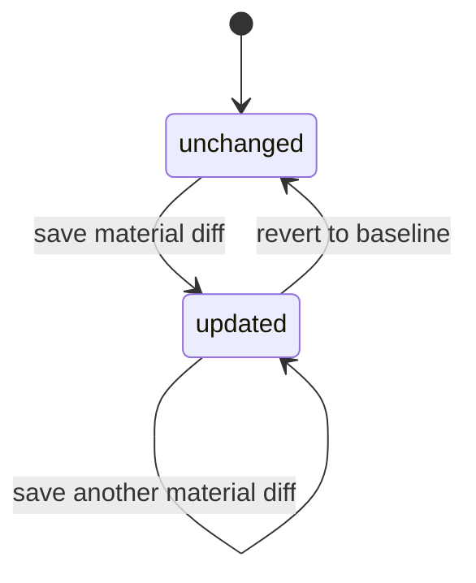

# Рекомендованная доменная модель для первого сохранения EditVersion

Отвечу как архитектор enterprise GIS и DDD-моделей для инженерных сетей, с практикой проектирования versioned edit workflows для utility network. Ниже — не попытка пересказать один конкретный стандарт, а **рекомендуемое правило модели** для вашего ближайшего slice, выведенное из загруженного файла о роли UtilityGisEditor, из официальной документации Esri по Utility Network, branch versioning, dirty areas и applyEdits, а также из официальных материалов Microsoft по DDD-агрегатам, ubiquitous language и domain events. Ключевой контекст из файла важен: редактор здесь работает не с “простым CRUD карты”, а с **авторитетной сетевой моделью**, где изменения живут в изолированной версии, а review/post — отдельная, более поздняя стадия. fileciteturn0file0 citeturn25view0turn6view1turn23view2turn24view0

## Исходная позиция для этого slice

Самая важная развилка здесь такая: если принять логику Utility Network и branch versioning всерьез, то **first save** не должен пытаться одновременно решить редактирование, review, reconcile, post, topology validation и conflict resolution. В Esri named version — это изолированное рабочее состояние, которое со временем расходится с default; dirty areas фиксируют, что правка произошла, но topology validation не выполняется автоматически после каждого редактирования, а reconcile/post — это отдельный процесс сравнения edit version с default. Именно поэтому первый slice лучше трактовать как **локальное, изолированное, детерминированное сохранение change set внутри EditVersion**, а не как “почти review”. fileciteturn0file0 citeturn25view0turn28view2turn29view0turn26view0

Из этого следует и граница агрегата. DDD-подход рекомендует использовать агрегаты как **границы транзакционной консистентности** и держать их маленькими, включая только то, что обязано оставаться согласованным в одной транзакции. Для вашего ближайшего инкремента это означает: в одной команде менять один feature в одном EditVersion, проверяя только те инварианты, которые нужны, чтобы сохранить **осмысленный persisted change set**, но не притворяясь full review. citeturn24view0turn23view1

## Решение для первого сохранения

**Что считать первым persisted change set.**
Для доменной модели рекомендую правило: **persisted change set = любой материальный diff относительно baseline EditVersion, который успешно сохранен и не нарушает hard-blockers агрегата**. Но для **первого** slice этот общий принцип надо сузить: минимальным persisted change set считать **изменение geometry существующей линии**, только если resulting geometry отличается от baseline geometry, линия остается тем же feature identity, и сохраняются slice-инварианты. В Esri dirty areas создаются и для geometry, и для network attribute / asset-type / associations изменений; значит общий доменный принцип в будущем можно расширить на атрибуты, но сейчас безопаснее начать именно с geometry-only для line feature. citeturn29view2turn29view3turn25view0

**Семантика `operation=updated`.**
`updated` должно означать не “пользователь когда-то нажал Save”, а **“текущее persisted состояние EditVersion отличается от baseline”**. Это соответствует versioning-логике common ancestor/current/target: meaningful status — это различие состояний, а не сам факт попытки действия. Поэтому если change set снова стал пустым, `operation` должен вернуться в `unchanged`; историю попыток лучше держать в audit trail / domain events, а не в operation-state. citeturn28view0turn28view1turn25view1

**Первая допустимая mutation.**
Для узкого и детерминированного slice я рекомендую правило: **разрешен сдвиг одной или нескольких внутренних вершин существующей polyline без изменения стартовой и конечной вершин, part count и vertex identity набора**. Проще говоря, вы позволяете “подправить изгиб” линии, но не меняете ее логические концы. Это лучше, чем “изменение любой вершины” или “замена всей geometry”, потому что endpoint-правки и полная замена быстрее затрагивают connectivity, ассоциации и topology semantics, а Esri явно отделяет геометрию линии, endpoint connectivity policy и association behavior. Для line features по умолчанию edge connectivity policy — `End vertex`, а network validation отдельно проверяет network rules и edge connectivity policies, то есть концы линии — не просто геометрическая декоративность, а часть сетевого смысла. citeturn15view1turn29view0turn29view1turn15view0

**Примеры допустимого и недопустимого.**
Допустимо: существующая линия с тремя вершинами, где средняя вершина сдвигается на 20 см внутри AOI, а начальная и конечная координаты остаются прежними; после save resulting geometry валидна, line identity та же, persisted diff непустой. Недопустимо: сдвиг начальной или конечной вершины линии; вставка новой вершины; удаление вершины; split/merge линии; замена geometry целиком новым набором вершин; перевод линии в multipart; любое изменение, которое по сути меняет endpoint behavior или может скрыто поменять association semantics. Это инженерное сужение не противоречит Esri-reality, а просто сознательно берет **наименее рискованный поднабор**. citeturn15view1turn15view2turn14view1turn29view0

**Какой baseline использовать для diff.**
Source of truth для diff должен быть **baseline geometry, зафиксированный в момент создания EditVersion** — то есть ваш common ancestor snapshot, а не текущий default на момент save. В branch versioning common ancestor — это представление данных, когда named version была создана или последний раз reconciled с default; именно относительно такого состояния и имеет смысл вычислять “изменено / не изменено” внутри EditVersion. Текущий default нужен не для локального diff, а для downstream stale/conflict processing. Если сейчас смешать baseline с live default, вы разрушите детерминизм readback и не сможете стабильно ответить на вопрос “вернулся ли я к baseline”. citeturn28view0turn28view1turn28view2turn26view0

**Что происходит при revert к baseline.**
Если editor возвращает geometry ровно к baseline, результат должен быть: `operation = unchanged`, persisted change set исчезает, `dirtyRelativeToBaseline = false`. Иначе вы получите “исторически dirty, но фактически unchanged” объект, который будет путать submit readiness, review diff и повторные save. История действия при этом не теряется — она просто должна жить не в текущем state, а в event/audit log. Это соответствует state-based интерпретации edit version, где meaningful distinction — текущее отличие от baseline, а не накопленная память обо всех промежуточных жестах. citeturn28view0turn25view1turn23view1

**Как назвать команду.**
Для первого slice лучше выбрать **`UpdateEditVersionFeatureGeometry`**, а не общее `UpdateEditVersionFeature`. Причина не косметическая, а доменная: ubiquitous language должна выражать реальное намерение одной транзакции, а Esri сама разделяет классы изменений — geometry, network attributes, associations, terminal configuration. Если сейчас назвать команду слишком широко, вы преждевременно размоете boundary модели и подтянете в нее атрибутные и association-сценарии, для которых инварианты уже другие. В DDD-линейке это как раз тот случай, когда intent-specific command лучше generic update. Если позже понадобится sibling-slice для атрибутов, добавьте отдельную команду `UpdateEditVersionFeatureAttributes`. citeturn29view3turn23view2turn24view0

**Какие типы объектов входят в first slice.**
Минимальный, но не искусственный набор — **существующая line feature, geometry-only**. Не point, не device, не junction, не junction/edge objects, не association rows. Это оправдано тем, что line geometry edit реально полезен, легко демонстрируется, и при этом допускает жесткий invariant “endpoints не трогаем”. Point/device/junction редактирование слишком быстро упирается в coincidence, terminals, junction-junction или junction-edge associations; Esri feature restrictions и connectivity semantics показывают, что эти классы объектов живут в более насыщенной сетевой логике. Поэтому first slice лучше осознанно ограничить существующей линией, а не пытаться с первого шага сделать “все spatial feature types”. citeturn15view0turn15view2turn14view1turn6view0

**Что предпочесть в persistence: full snapshot или diff.**
Предпочтительное представление — **full resulting geometry snapshot как source of truth**, а diff — производный артефакт, вычисляемый от baseline при readback/review, при желании кэшируемый позже. Esri edit APIs и conflict tooling оперируют полными feature representations: `applyEdits` принимает geometry, edit results говорят об успехе по feature, а режим `originalAndCurrentFeatures` возвращает полные original/current features для updates; в Conflicts view тоже сравниваются full Current / Target / Common Ancestor representations, включая geometry. Поэтому pure geometry-diff как единственная persisted форма слишком хрупок для будущих review/conflict сценариев. Лучший компромисс: **baseline snapshot + current snapshot**, diff вычисляется между ними. citeturn19view0turn27view2turn28view0

## Инварианты и базовая проверка

**AOI rule.**
Для first slice рекомендую блокирующее правило: **линия должна целиком оставаться внутри AOI**, а не просто пересекать AOI. Пересечение слишком слабое условие: оно допускает partially-outside geometry и делает UI/readiness двусмысленными. Для узкого инкремента нужна максимально детерминированная и легко объяснимая граница: “если хоть часть линии выходит за AOI — save запрещен”. Это согласуется с идеей локального work zone и с тем, что Esri сама рекомендует локализованный current extent / work zone как типичный рабочий контур validation. Это уже отчасти доменное решение вашей системы, но для ближайшего slice оно наименее спорное. citeturn29view0turn25view0turn0file0

**Что означает `endpoint unchanged`.**
Доменный смысл должен быть **“те же логические endpoint-связи и та же endpoint-role feature”**, то есть по сути invariance по feature identity / connectivity role, а не просто “почти те же координаты”. Но в первом slice, где associations и topology mutation не входят в scope, я бы операционализировал это более строгим прокси-правилом: **координаты start/end vertex должны совпадать с baseline точно, и any endpoint move запрещен**. Это честнее, чем пытаться уже сейчас вычислять настоящую connectivity-эквивалентность. Иначе вы получите скрытую мутацию сетевого смысла под видом “обычной geometry edit”. citeturn15view0turn15view1turn15view2turn29view0

**Какие проверки блокируют persist, а какие превращаются в validation flags.**
В hard blockers я бы поместил: неверный editor или закрытый status EditVersion; feature не найдена или не входит в scope first slice; stale `DraftVersionToken`; geometry не проходит базовую валидность; resulting geometry не целиком внутри AOI; меняются endpoints; меняется vertex count / part count; команда подразумевает split, merge, create, delete или association mutation. В validation flags после успешного save я бы оставил: `geometryValid=true`, `insideAoi=true`, `associationsUnchanged=true`, `topologyNotChecked=true`, `dirtyRelativeToBaseline=true|false`. Логика здесь опирается на то, что Esri различает edit save и later topology validation: dirty areas появляются из-за edit, а network rules / edge connectivity / topology errors выявляются отдельной validate-операцией, которая не запускается автоматически после каждого edit. citeturn19view0turn29view0turn29view1turn29view2

**Когда считать validation.**
Базовую draft validation стоит считать **синхронно при save**. Это не должно быть full topology validation, но geometry validity, AOI containment, endpoint unchanged и dirtyRelativeToBaseline должны быть известны сразу — иначе UX после save будет неустойчивым. При этом `topologyNotChecked` должен явно оставаться `true`, потому что Esri topology validation — отдельное действие, которое оценивает network rules и edge connectivity policies только при validate, а не при каждом edit. Иными словами: первый save синхронно считает **cheap local validation**, а full network semantics сознательно откладывает. citeturn29view0turn29view1turn6view0

**Как трактовать `topologyNotChecked` и `associationsUnchanged`.**
`topologyNotChecked=true` должно означать: **редактирование можно продолжать, readback можно показывать, но submit/review/post еще запрещены**. Это очень важно: такой флаг не должен звучать как ошибка save, он должен звучать как честная граница slice. А `associationsUnchanged` для first slice лучше сделать не “вычисляемым сравнением rows”, а **инвариантом успешного сохранения**. То есть при successful save этот флаг всегда `true`, потому что любая попытка association mutation должна уже раньше попасть в hard blocker. Сравнение association rows пригодится позже, когда associations войдут в настоящую модель diff/review. citeturn14view1turn29view0turn6view0

## Версионность и конкурентность

**Что такое `networkVersion` или baseline network revision в draft-row.**
Если этот атрибут у вас есть, ему лучше дать доменный смысл **baseline-факта**, а не concurrency token. То есть это “какой revision default/common ancestor был актуален, когда был создан EditVersion или когда baseline был refresh/reconcile”, а не “версия текущей draft-строки”. В терминологии Esri named version начинается как identical to parent, дальше расходится, а reconcile сравнивает edit version с target/default; значит baseline network revision нужен как reference point для later stale/conflict logic, но не как механизм optimistic concurrency внутри агрегата. citeturn28view2turn28view1turn26view0

**Что такое `DraftVersionToken`.**
`DraftVersionToken` рекомендую трактовать как **версию всего агрегата EditVersion**, а не feature row version и не hash текущего change set. Практически это должен быть opaque token наподобие `rowversion` / monotonically increasing revision / ULID-with-revision, который меняется **на любой успешной persisted мутации внутри EditVersion**: change set изменился, validation summary изменилась, metadata агрегата изменилась. DDD-подход прямо говорит, что aggregate — это ваша transactional consistency boundary; значит и concurrency token должен защищать именно ее. Это хорошо сочетается с тем, что в ArcGIS branch editing есть свои `sessionID` и `editMoment` для long transaction isolation, но это другая плоскость: они не заменяют доменный токен EditVersion. citeturn24view0turn23view1turn20view0turn20view2

**Что делать с повторным save тем же token.**
Здесь лучше развести две вещи. **Optimistic concurrency** и **idempotent retry** — не одно и то же. Если successful save уже произошел, то `DraftVersionToken` должен смениться; значит повторный запрос со старым token по смыслу уже stale и должен давать `conflict`. Если вам нужен хороший retry UX, не перегружайте токен этой задачей: добавьте отдельный `CommandId` / idempotency key. Тогда повтор того же command с тем же `CommandId` можно вернуть как idempotent success с тем же readback, а другой запрос со старым token — как настоящий conflict. Это лучше согласуется и с DDD-подходом, где command должен быть обработан один раз, и с явной ролью token как защитой от stale draft, а не как маркером ретраев. citeturn23view1turn20view2

**Нужно ли на first save проверять свежесть default.**
Мой выбор — **отложить**. На first save не проверять свежесть current Default как hard requirement. Это downstream concern для reconcile/review/post. Branch versioning как раз и существует затем, чтобы редактор мог работать в изоляции, а конфликтность с default оценивалась при reconcile/post относительно target/default и common ancestor. Если сейчас втянуть live-default freshness в first save, вы преждевременно смешаете локальную фиксацию change set с конфликтами публикации. Поэтому baseline network revision на edit-slice сохраняем как reference fact, а stale/default-change checks делаем next slice-ом, ближе к review/post. fileciteturn0file0 citeturn25view0turn26view0turn28view0

## Readback, события и граница инкремента

**Минимальный readback после save.**
Для ближайшего контракта достаточно возвращать **обновленную feature**, **новый `DraftVersionToken`**, **`operation` / `hasPersistedChangeSet`**, и **validation summary**. Весь workspace возвращать не нужно; одного “success=true” тоже недостаточно, потому что этого мало для фронтенда и для доказательства, что измененное состояние реально закрепилось как новое persisted draft state. В Esri `applyEdits` базово возвращает массив edit results per feature, а в расширенном режиме может вернуть full original/current features; это хороший ориентир на то, что robust readback должен содержать как минимум resulting feature state, а не только acknowledgement команды. citeturn27view0turn27view2turn27view3turn20view0

**Нужен ли явный diff в readback.**
Для first slice — **нет, не как обязательный minimum proof**. Минимальным proof я бы считал resulting feature snapshot + `hasPersistedChangeSet=true` + validation flags. Diff можно вычислить на клиенте или отдельным query later, потому что source of truth у вас должен быть state-based: baseline snapshot и current snapshot. Явный diff summary может появиться позже, когда вы начнете готовить review package. Сейчас важнее не перегрузить контракт, но гарантировать, что после save у клиента есть ровно то состояние, которое сервер считает persisted. citeturn27view2turn28view0turn25view0

**Какое событие фиксировать.**
Для первого slice оптимальный язык событий такой: **`EditVersionChangeSetPersisted`** — при переходе `unchanged -> updated`; **`EditVersionChangeSetCleared`** — при переходе `updated -> unchanged`; повторный identical retry события не создает. Если вы пока хотите оставить только одно событие, то пусть это будет именно `EditVersionChangeSetPersisted`, и возникает оно не “на каждый save”, а **когда в агрегате впервые появляется непустой persisted change set**. Такое имя хорошо совпадает с ubiquitous language: событие описывает то, что уже произошло, в past tense, и не смешивает save с review/post. DDD-материал Microsoft прямо рекомендует именовать domain events как past-tense domain occurrences и использовать их для side effects между aggregate boundaries. citeturn23view1turn24view0turn23view2

**Что editor должен уметь уверенно сказать после first save.**
Правильная целевая фраза не “готово к review”, а примерно такая: **“Я изменил объект; у EditVersion теперь есть сохраненный dirty change set; draft прошел базовую проверку, но topology/review еще не выполнены.”** Это честно отражает стадию модели и не перескакивает через следующий bounded step. Загруженный файл как раз подчеркивает, что change governance, topology QA и reconcile/post — самостоятельные этапы, а не одно действие. fileciteturn0file0 citeturn29view0turn25view0turn26view3

**Где stop-line ближайшего инкремента.**
Exit criteria этого ближайшего slice я бы формулировал так: **persisted change set создан; readback вернул resulting feature и новый token; basic draft validation посчитана; UI отображает resulting geometry; `topologyNotChecked=true`; submit/review/post недоступны**. Operation summary и полноценная визуализация diff — полезны, но не обязательны для завершения 14-дневного инкремента. Если выбирать из ваших вариантов самый правильный, то это **persisted + readback + draft validation**. citeturn27view0turn27view2turn29view0turn0file0

## Рекомендуемый demo-case и явные non-goals

**Лучший детерминированный demo-case.**
Первым demo-case я бы взял **сдвиг внутренней вершины существующей линии**. Это самый низкорисковый сценарий, потому что он одновременно реалистичен для сетевой ГИС и хорошо тестируется: у вас есть baseline polyline, AOI, одна внутренняя вершина, expected resulting geometry, expected `updated`, expected validation flags и ожидаемый revert-to-unchanged. На point/device/junction сценариях вы слишком рано увязнете в coincidence, terminals и association behavior. А нетопологический attribute change хорош как следующий slice, но он хуже демонстрирует общую механику geometry-first save и readback. citeturn15view0turn15view1turn29view0turn0file0

**Что явно вне scope этого slice.**
Чтобы защитить спринт от расползания, я бы явно оставил вне scope: create/delete feature; split/merge line; move line endpoints; point/device/junction edits; любые attribute updates; создание/удаление/редактирование associations; topology trace; Validate Network Topology как полноценную сетевую проверку; reconcile/post; submit for review; review package; can_post; workspace-wide operation summary; live-default freshness blocking на save; field-level diff UI. Такой список не “урезает” модель искусственно — он просто удерживает инкремент внутри одной транзакционной границы и не смешивает first save с downstream governance. fileciteturn0file0 citeturn29view0turn26view0turn14view1turn24view0

Итоговое рекомендуемое решение можно сформулировать одной фразой: **первый slice должен сохранять geometry-only diff существующей линии относительно baseline EditVersion, считать cheap synchronous validation, возвращать resulting feature + token + flags, переводить состояние в `updated` только при реальном отличии от baseline и сознательно не брать на себя semantics review/post/topology reconciliation**. Это наилучшим образом совпадает и с ролью UtilityGisEditor из загруженного файла, и с реальной логикой Utility Network / branch versioning, и с DDD-подходом к небольшим агрегатам и понятному ubiquitous language. fileciteturn0file0 citeturn25view0turn28view0turn29view0turn24view0turn23view2
