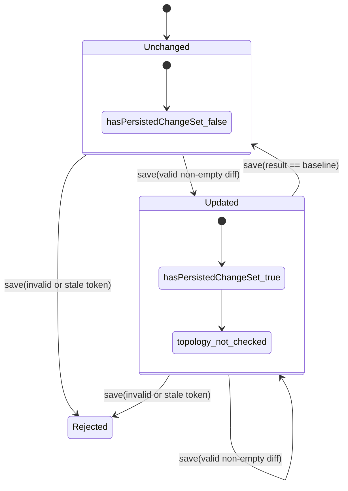

# First Save для EditVersion в Utility Network

Отвечаю в роли архитектора enterprise GIS и DDD-моделей для utility networks, лауреата **Esri Special Achievement in GIS Award**.

Ниже — не пересказ одной конкретной платформы, а **рекомендуемая доменная модель first save**, собранная на основе вашего файла о роли UtilityGisEditor, где редактирование понимается как работа с **авторитетной сетевой моделью в versioned workflow**, а не как простой CRUD по геометрии, и на основе официальных материалов Esri/PostGIS по versioning, diff, utility network connectivity, dirty areas, geometry validity и optimistic concurrency. В версии с branch versioning изменения живут в **изолированной named version**, сравниваются как **Current / Target / Common Ancestor**, а конфликты с `default` обнаруживаются на reconcile, а не на каждом локальном save. Это очень сильный сигнал, что в вашей доменной модели first save должен быть про **фиксацию текущего допустимого чернового состояния относительно неизменяемого baseline**, а не про слияние с текущим Default или про преждевременный review/post. fileciteturn0file0 citeturn22view0turn10view0turn15view0turn15view1turn11view3

## Контекст и принцип выбора модели

В официальном utility-network workflow есть сразу три важных факта. Во-первых, **named version — это отдельный изолированный контур редактирования**, часто под work order или job; изменения держатся там до reconcile/post. Во-вторых, сравнение делается между **Current**, **Target** и **Common Ancestor**, где common ancestor — это состояние до редактирования или на момент последнего reconcile. В-третьих, после правок сеть получает **dirty areas** и требует отдельной validate-процедуры для аналитики; это означает, что “сохранено” и “полностью проверено / готово к submit” — это не одно и то же состояние. citeturn22view0turn10view0turn15view0turn15view1turn11view3turn0search0

Из этого следует базовый проектный принцип для first slice: **save фиксирует допустимый persisted draft state внутри EditVersion**, а не окончательную сетевую корректность относительно всего мира. Поэтому consistency boundary для атомарного save должен быть у **EditVersion**, тогда как WorkOrder остаётся источником внешних ограничений — назначение редактора, AOI, бизнес-контекст и жизненный цикл работы. Это уже проектная рекомендация, но она хорошо согласуется и с вашим файлом, и с тем, как branch versioning отделяет isolated edit work от integrate-to-default. fileciteturn0file0 citeturn22view0turn21view0turn21view1

Ключевой вывод в одном абзаце: **команда сохраняет resulting geometry текущего draft-feature**, diff считается относительно **immutable baseline**, первый slice ограничивается **одной существующей line feature**, hard invariants нарушать нельзя, поэтому невалидный first save **отклоняется атомарно**, а не сохраняется как “blocked draft”. При этом basic validation summary после успешного save сохраняется вместе с черновиком, но `topologyNotChecked` явно остаётся `not_checked`, чтобы не перепрыгнуть в submit/review раньше времени. citeturn11view3turn14view0turn18view0turn11view6turn11view7

## Команда, baseline и граница агрегата

### Рекомендуемая форма команды и change set

| Вопрос | Рекомендация | Почему |
|---|---|---|
| Что означает `UpdateEditVersionFeatureGeometry` | **“Заменить текущую persisted geometry feature на переданную resulting geometry в рамках EditVersion”** | Это лучше отражает доменное намерение, чем “сохранить diff” или “применить UI-операцию”. В реальных GIS-редакторах одна и та же правка может прийти как move vertex, move segment, reshape или replace geometry, но домену важен именно **итоговый shape**. Esri прямо поддерживает и vertex editing, и segment editing, и reshape, и replace geometry как разные UI-способы получить новый итоговый shape. citeturn16view0turn16view1turn16view2turn17search0turn18view0 |
| Full geometry, `MoveInternalVertex` или гибрид | **Atomic intent = full resulting geometry**; **guard rule first slice = ровно один допустимый diff класса “single internal vertex move”** | Так API остаётся устойчивым к разным UI-инструментам, но модель при этом жёстко отсекает неподдерживаемые изменения. Это фактически “full geometry contract + narrow diff validator”, но если выбрать одно имя для намерения команды, это всё равно **replace resulting geometry**. citeturn16view0turn16view1turn16view2turn17search0 |
| Что считается первым persisted change set | **Непустой допустимый diff относительно immutable baseline после успешного save** | Ветки версий и Differences view оперируют текущими различиями Current/Target/Common Ancestor, а не фактом “когда-то что-то сохраняли”. Поэтому persisted change set должен быть именно текущим состоянием отличия, а не историей действий. citeturn15view1turn15view2turn10view1 |
| Что значит `operation=updated` | **“Сейчас отличается от baseline”**, а не “пользователь когда-то жал Save” | В Differences view `Update` — это текущая разница, а не журнал прошлых намерений. Для истории нужно отдельное audit/event storage. citeturn15view1turn15view2turn10view1 |
| Если вернули geometry к baseline | **`operation=unchanged`, `hasPersistedChangeSet=false`, change set исчезает из доменного состояния** | Это согласуется с current-diff моделью. История факта “редактировали, потом отменили” должна жить в audit/event stream, а не в текущем доменном state. citeturn15view1turn15view2turn12view4 |
| Хранить full snapshot или diff | **Persist full current snapshot + immutable baseline snapshot; diff вычислять как projection/read model** | Esri сравнивает целые представления Current/Target/Common Ancestor; в Conflicts view замена делается целым feature representation, включая geometry. Для first slice persist-diff избыточен и усложняет revert/readback. citeturn15view0turn15view1turn17search0 |

### Baseline и граница агрегата

| Вопрос | Рекомендация | Почему |
|---|---|---|
| Где лежит baseline | **Отдельная immutable baseline-копия feature внутри EditVersion** | Если baseline брать из “текущего Default на момент save”, diff будет дрейфовать при внешних изменениях в `default`. Branch versioning отделяет isolated edit version от target default, а common ancestor — это состояние до редактирования / на момент последнего reconcile. Это практически прямой шаблон для внутреннего immutable baseline. citeturn10view0turn15view0turn15view1turn22view0 |
| Один изменённый объект или несколько | **Для first slice — одна изменённая line feature во всём EditVersion** | Это самый маленький, но не искусственный инкремент: он уже покрывает persisted change set, baseline, revert, token, validation summary и readback. Несколько features на aggregate сильно расширяют concurrency, summary и review vocabulary. В branch-version сценариях единицей работы часто выступает work order/job, но nothing forces multi-feature in first save. citeturn22view0turn21view0turn21view1 |
| Кто aggregate для атомарного save | **EditVersion** | Изменяемое черновое состояние, token, baseline, validation summary и change set принадлежат EditVersion. WorkOrder должен задавать внешние правила: editor assignment, AOI, статус работы, разрешённый scope. Это лучшая граница consistency для first save. fileciteturn0file0 citeturn22view0turn10view0 |
| Что такое `networkVersion` в draft-строке | **Baseline revision reference**, а не concurrency token | Иначе смешиваются две разные вещи: “от какой сетевой реальности мы считаем diff” и “какую версию текущего draft-state обновляет клиент”. Практически лучше переименовать в `BaselineRevisionRef`; если переименование пока невозможно, скрыть `networkVersion` из доменного write/read контракта и не давать ему играть роль token. citeturn10view0turn15view0turn12view5 |

Первая допустимая mutation в таком срезе должна быть очень узкой: **сдвиг одной внутренней вершины существующей line feature при неизменных endpoints, неизменном vertex count, неизменном числе parts и неизменном feature identity**. То есть команда принимает целиком новую resulting geometry, но validator пропускает только один тип diff. Допустимо: линия из 5 вершин, смещена вершина с индексом `2`, все остальные координаты после нормализации совпадают с baseline. Недопустимо: смещение начальной или конечной вершины; добавление/удаление вершины; замена на multi-part; reshape, который меняет несколько внутренних вершин; полная подмена geometry с иным coordinate structure. citeturn16view0turn16view1turn17search0turn18view0

## Пространственные инварианты и basic validation

Для utility network это самый опасный участок модели. В официальной документации connectivity возникает из **geometric coincidence** и association rules; shared endpoints и совпадающие x/y/z могут создавать или разрывать connectivity, а utility-network editing tools даже умеют автоматически тянуть connected assets вместе с геометрией. Поэтому first slice должен **намеренно избегать endpoint mutation**. Иначе вы незаметно заходите в домен terminal connections, associations и topology side effects. citeturn11view1turn14view0turn13view0turn18view0

### Правила eligibility и AOI

| Вопрос | Рекомендация | Почему |
|---|---|---|
| Видимость и редактируемость | **Да, различать**: показывать можно все features, пересекающие AOI; редактировать в first slice — только lines, **полностью покрытые AOI** и имеющие хотя бы одну внутреннюю вершину | Это снимает расхождение между workspace visibility и save invariant. Для blocking-save нужен более строгий критерий, чем просто “была видна”. fileciteturn0file0 citeturn20search6turn7search0 |
| AOI policy | **`insideAoi = ST_CoveredBy(line, AOI)`**, то есть вся линия должна лежать в AOI, **граница допустима** | `ST_CoveredBy` как раз включает границу и обычно предпочтительнее `ST_Within`, у которого есть “quirk” с boundary. Это даёт предсказуемое правило без искусственного запрета касания границы. citeturn11view4turn20search6turn11view5 |
| Разрешено ли касаться границы AOI | **Да, boundary allowed** | Это прямое следствие выбора `CoveredBy`, а не `Within`. citeturn11view4turn20search6 |
| Какие типы объектов в first slice | **Только существующая spatial `Line` feature** | Point/device/junction сразу втягивают implicit connectivity, terminals, midspan logic и association rules. Для line-only slice риск гораздо ниже и инкремент остаётся реалистичным. citeturn11view1turn13view0turn18view0 |

### Endpoints, vertex structure и геометрические ограничения

| Вопрос | Рекомендация | Почему |
|---|---|---|
| Что такое identity внутренней вершины | **Позиция в immutable baseline-coordinate-array** | В first slice вы запрещаете insert/delete vertices, значит стабильный `VertexId` пока не нужен. Индекс в baseline-массиве полностью детерминирует “какую вершину можно двигать”. |
| Как определять неизменность endpoints | **Сравнение нормализованных endpoint coordinates с baseline + запрет любых association-row updates** | В utility network shared endpoint coordinates участвуют в connectivity; движение line end может утащить connected assets или разорвать coincidence. Поэтому доменный смысл “endpoint unchanged” в first slice — topology-facing endpoints не менялись. Практически это удобнее всего проверять по нормализованным координатам плюс отсутствию association mutation surface. citeturn11view1turn14view0turn18view0 |
| Точное равенство или tolerance | **Нормализация к dataset precision / grid, затем equality на нормализованных координатах** | Бинарное равенство даёт ложные изменения из-за floating noise. PostGIS прямо предлагает precision reduction / snap-to-grid как способ привести координаты к рабочей точности. Для first slice это лучше, чем “произвольная epsilon-магия” в нескольких местах модели. citeturn19search0turn19search2 |
| Запрещать ли изменение endpoints | **Да** | Иначе вы заходите в connectivity mutation. В ArcGIS moving/editing network geometry может тянуть coincident/connected features; Disconnect делает это явной управляемой операцией. Для безопасного first slice endpoints надо заморозить. citeturn14view0turn18view0 |
| Сохранять invalid/out-of-AOI/prohibited draft или reject | **Reject atomically** | Hard invariants должны отсеиваться на save. Dirty areas и later topology validation — это уже механизм сетевой валидации после допустимого edit, а не лицензия сохранять заведомо запрещённое состояние своего aggregate. Кроме того, если network rule не позволяет association, сам edit может фейлиться сразу. citeturn11view3turn14view0turn11view6turn11view7 |

### Vocabulary basic validation

Для first save я рекомендую **не flat booleans “навсегда”**, а маленький набор статусов `passed / failed / not_checked`. Это чуть дороже booleans, зато сразу решает неоднозначность `topologyNotChecked` и не заставляет потом ломать контракт. `geometryValid` при этом должно означать минимум: correct geometry type, well-formed/valid in 2D и simple enough for line-workflow without self-intersection/self-tangency; для line slice также обязательно сохраняются part count, vertex count и endpoint positions относительно baseline. citeturn11view6turn11view7turn16view0turn16view1

| Флаг | Статус в first slice | Значение |
|---|---|---|
| `geometryValid` | `passed` / `failed` | `passed`, если resulting geometry — валидная и простая line geometry, без structural drift относительно baseline. citeturn11view6turn11view7 |
| `aoiCovered` | `passed` / `failed` | `passed`, если вся resulting line покрыта AOI, включая границу. citeturn11view4turn20search6 |
| `associationsUnchanged` | всегда `passed` в first slice, но как **вычислимое evidence** | Это одновременно invariant и surfaced evidence: command surface не позволяет менять associations, а proof можно получить сравнением association rows позже. В first slice результат должен быть всегда `passed`; иначе save не должен был пройти. citeturn14view0turn13view0 |
| `topologyChecked` | `not_checked` | После first save можно продолжать редактирование и делать readback, но нельзя считать draft готовым к submit. Dirty areas и validate topology в ArcGIS — отдельный этап. citeturn11view3turn0search7 |
| `dirtyRelativeToBaseline` | `passed` как info, если diff непустой; `failed`/`false`, если revert | Это информационный флаг текущей разницы, а не критерий качества. |
| `concurrencyOk` | `passed` / `failed` | Проверка token на optimistic concurrency. При `failed` команда не должна менять aggregate. citeturn12view5 |

Ниже — рекомендуемая мини-машина состояний для first save.

Эта схема означает важную вещь: **first save создаёт draft fact, но не review readiness**. После успешного save редактор может уверенно сказать: **“я сохранил допустимое черновое изменение; у версии есть persisted change set; базовая проверка выполнена; topology/review ещё впереди”**. Это ровно та промежуточная остановка, которой не хватает, когда модель слишком рано прыгает в review/post. fileciteturn0file0 citeturn11view3turn0search7

## Конкурентность, token и повтор запросов

Branch versioning сам по себе уже предполагает изоляцию named version и single-editor semantics на уровне версии, но для API вашего draft aggregate этого недостаточно: браузер может держать несколько вкладок, response может потеряться, а повтор save без чёткого token/command-id даёт либо silent overwrite, либо плохой UX. Поэтому нужны **два разных механизма**: `DraftVersionToken` для optimistic concurrency и `CommandId` для idempotent retry. citeturn21view1turn22view0turn12view5turn12view3turn12view4

### Что должно быть token, а что нет

| Вопрос | Рекомендация | Почему |
|---|---|---|
| Scope `DraftVersionToken` | **Per-EditVersion aggregate** | В first slice меняется один aggregate, и concurrency должна защищать именно весь persisted draft state: текущую geometry, `hasPersistedChangeSet`, validation summary и lifecycle поля версии. Per-feature token пока не нужен. |
| Формат token | **Opaque strong validator**, аналог ETag | `If-Match`/ETag в HTTP — хороший эталон optimistic concurrency: token описывает текущее состояние representation и не подменяет baseline reference. citeturn12view5turn9search2 |
| Когда выдаётся первый token | **При первом read/open EditVersion** | Клиент должен получить валидатор ещё до первой mutation, иначе нет lost-update protection. |
| Что меняет token | **Только content-changing mutations**: change set created/updated/cleared, geometry snapshot changed, validation summary changed как следствие save, lifecycle/status changed | Operational mutations вроде `lastOpenedAt`, refresh, повторного read и пересчёта того же результата token менять не должны; иначе вы вводите лишние conflicts без реального доменного изменения. |
| No-op save | **Не меняет token** | Если resulting geometry после нормализации равна текущему persisted state, это не новый state. |
| Что такое `networkVersion` после draft edit | **Не token**; это baseline reference, лучше скрыть/переименовать | Иначе один идентификатор начнёт одновременно означать и “откуда считаем diff”, и “какую draft-version клиент обновляет”, что опасно и семантически, и UX-wise. |

### Idempotency и stale behavior

| Вопрос | Рекомендация | Почему |
|---|---|---|
| Нужен ли `CommandId` уже сейчас | **Да, нужен уже в первом slice** | IETF draft по `Idempotency-Key` рекомендует: повтор с тем же ключом и тем же payload должен вернуть результат уже завершённой операции; ключ не должен переиспользоваться для другого payload. Это идеально решает сценарий “save сработал, но ответ потерялся”. citeturn12view2turn12view3 |
| Повтор того же save с тем же token и тем же `CommandId` | **Idempotent success** | Это поведение лучше retry UX и согласуется с общей идеей идемпотентности: одинаковый повтор не должен ломать состояние. citeturn12view3turn12view4 |
| Повтор без `CommandId`, но после потери ответа | **Плохой кейс; возможен stale-token conflict или 2xx only if already applied is detectable** | RFC 9110 допускает, что state-changing request при `If-Match` может вернуть 2xx, если изменение уже применено, но полагаться только на это для продуктового UX хуже, чем иметь явный `CommandId`. citeturn12view5 |
| Что делать при stale `DraftVersionToken` | **Отклонять команду и возвращать актуальный persisted object + новый token в error payload** | Lost-update protection должна быть строгой, но recovery должен быть удобным: клиенту нужен не только “conflict”, но и свежая persisted reality для refresh/merge. Это соответствует духу `If-Match`: метод не выполняется, если validator не совпал. citeturn12view5 |

Проверку свежести `default` на first save я рекомендую **не делать**. В branch versioning named version специально создана, чтобы жить изолированно, а конфликты с `default` обнаруживаются на reconcile. Если вы подтянете stale/default checks в first save, вы фактически сломаете саму идею long transaction и преждевременно смешаете save с downstream review/post. citeturn10view0turn15view0turn22view0

## Доказательство успешного save, события и stop-line инкремента

В Esri даже для branch-versioned data UI иногда требует refresh, чтобы увидеть обновления; следовательно, в вашем контракте нельзя полагаться только на “команда вернула 200”. Для first slice нужен маленький, но честный proof contract: **командный ответ должен подтвердить, что persisted draft state изменился, а отдельный readback должен показать тот же результат повторно**. Это особенно важно, если вы хотите потом строить review package поверх уже проверенной основы. citeturn22view0

### Минимальный контракт после save

| Вопрос | Рекомендация | Почему |
|---|---|---|
| Что вернуть сразу из команды | **`updatedFeature`, `draftVersionToken`, `operation`, `hasPersistedChangeSet`, `basicValidation`** | Это минимальный практический набор для фронтенда и smoke-tests. Baseline и explicit diff summary полезны, но для first slice не обязательны в command response. |
| Нужен ли baseline/diff в readback | **В response не обязателен; в read model допускается computed diff summary** | Source of truth — текущий snapshot и immutable baseline. Явный diff summary можно вычислять на чтении. citeturn15view1turn15view0 |
| Как выглядит минимальное end-to-end proof | **Командный ответ + повторный readback того же persisted state; proof должен переживать restart браузера/бэкенда** | Иначе это не доказательство persistence, а только локальная echo-репрезентация ответа. |
| Что происходит после revert to baseline | **Persisted current snapshot становится равен baseline; `operation=unchanged`; token увеличивается; генерируется `EditVersionChangeSetCleared`** | Состояние реально изменилось, хотя change set исчез. Поэтому token должен смениться. История остаётся в event/audit stream. |

### Доменные события и lifecycle

| Вопрос | Рекомендация | Почему |
|---|---|---|
| Нужен ли event уже на first save | **Да** | Event language лучше стабилизировать до review/post. Иначе позже придётся задним числом гадать, с какого момента downstream считает change set “реально persisted”. |
| Какой event | **`EditVersionChangeSetPersisted`** на каждый успешный save с непустым diff; **`EditVersionChangeSetCleared`** на revert к baseline | Каждое persisted состояние важно для audit/autosave/read-model subscribers. Edge-case “впервые стал dirty” можно вывести из последовательности событий или добавить later как derived signal. |
| Что в payload | `editVersionId`, `featureId`, `baselineRevisionRef`, `newDraftVersionToken`, `operation`, `hasPersistedChangeSet`, `basicValidation`, `geometryHash` или `bbox` | Этого хватает для downstream read-model, audit и дешёвой deduplication. |
| Меняется ли lifecycle/status после first save | **Нет: EditVersion остаётся `open`; WorkOrder остаётся `open/in_progress`** | First save фиксирует черновик, но не завершает validation/review/post pipeline. fileciteturn0file0 citeturn11view3turn10view0 |

### Acceptance boundary и первый demo-case

Я бы зафиксировал границу ближайшего инкремента так:

1. **Открыть EditVersion** и получить `DraftVersionToken`.
2. Выбрать **одну существующую line feature**, целиком покрытую AOI, минимум с тремя вершинами.
3. Выполнить изменение типа **“move one internal vertex”**.
4. Успешно выполнить save только если соблюдены hard invariants.
5. Получить response с `updatedFeature + newToken + hasPersistedChangeSet + operation + basicValidation`.
6. Повторным readback подтвердить, что persisted geometry та же самая.
7. Выполнить revert к baseline и убедиться, что состояние возвращается в `unchanged`. citeturn16view0turn15view1turn11view4turn11view6turn11view7

Лучший deterministic demo-case для first slice — **сдвиг одной внутренней вершины линии**. Он лучше, чем устройство/точка, потому что не тянет сразу terminal connectivity, device/junction semantics и association complexity; и лучше, чем нетопологический атрибут, потому что вы хотите сначала застолбить геометрическую и spatial инвариантную часть модели. Канонический пример: polyline из 5 вершин, AOI полностью её покрывает, смещается вершина с индексом `2`, endpoints и vertex count неизменны, resulting shape остаётся valid/simple и внутри AOI. citeturn13view0turn11view1turn18view0turn11view6turn11view7

Явно вне scope этого slice должны остаться: **create/delete feature, point/device/junction editing, attribute changes, endpoint edits, insert/delete vertex, association mutation, containment/attachment changes, topology validate, trace, submit for review, review package, post, can_post, multi-feature change set**. Это и есть правильный stop-line: после него команда может честно сказать не “готово к review”, а **“persisted first save сделан, readback подтверждён, базовые draft-инварианты соблюдены, topology/review — следующий проход”**. fileciteturn0file0 citeturn11view3turn10view0turn15view0turn18view0

## Итоговое решение

Если свести всё к одному набору решений, который можно положить в ADR уже сейчас, я бы зафиксировал следующее:

- **Aggregate boundary:** `EditVersion`.
- **Command intent:** `UpdateEditVersionFeatureGeometry = replace persisted resulting geometry`.
- **Allowed first-save diff:** только **single internal vertex move** на существующей **line feature**.
- **Baseline:** immutable baseline copy внутри `EditVersion`, source of truth для diff/revert.
- **AOI:** вся линия должна быть **covered by** AOI; граница допустима.
- **Endpoints:** frozen; любое их изменение запрещено.
- **Persistence shape:** current snapshot + baseline snapshot; diff — computed.
- **Validation policy:** hard invariant violations **reject atomically**; `topologyChecked = not_checked`.
- **Concurrency:** `DraftVersionToken` per `EditVersion`; `CommandId` обязателен для idempotent retry.
- **Eventing:** `EditVersionChangeSetPersisted` на каждый успешный save с непустым diff; `EditVersionChangeSetCleared` на revert.
- **Readiness after first save:** не review-ready, а **persisted-draft-ready**.

Именно такой набор лучше всего согласует ваш файл, где UtilityGisEditor работает с versioned authoritative network model, с публично описанными utility-network/work-versioning практиками и при этом даёт достаточно узкий, проверяемый и не искусственный first slice. fileciteturn0file0 citeturn22view0turn10view0turn15view0turn11view3turn18view0turn12view5turn12view3
