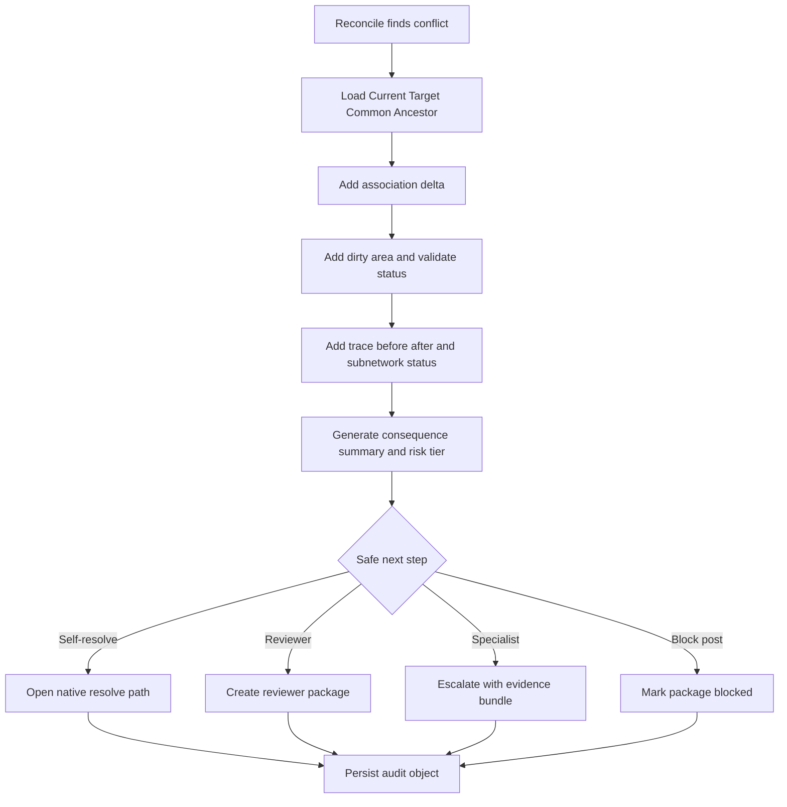

# Release 2 demo для geometry и association conflict explanation

Отвечаю как архитектор utility GIS и цифровых двойников инженерных сетей, с фокусом на authoritative network editing, branch versioning и операционные workflows для электрических, водоканальных и теплосетевых моделей.

## Короткий вывод

Минимальная demo-история для Release 2 должна доказывать не то, что система умеет показать **конфликт**, а то, что она умеет за **1–2 минуты объяснить, меняет ли конфликт authoritative network behavior**. Для этого лучший canonical scenario — не просто «линия сдвинулась», а **конфликт вокруг подключения линии к трансформатору через terminal-aware connectivity association**, где обычный Differences/Conflicts view показывает update/update по геометрии и атрибутам, а conflict package объясняет, меняется ли трассировка, subnetwork-участие и, следовательно, безопасно ли решение для post. В ArcGIS rules и associations именно такой пример показан как путь, по которому trace проходит через линию, tap и terminal трансформатора; это делает сценарий доменно сильнее, чем чисто визуальный geometry conflict. В приложенном файле сам use case тоже задан как редактирование **авторитетной модели инженерной сети**, а не просто карты, с branch versioning, reconcile/post, audit и office/field контекстом. fileciteturn0file0 citeturn10view0turn15view0turn15view1turn17view0turn11view0

Если свести ответ к одной фразе, то **demo должна показать, что GeoService лучше baseline не потому, что красивее показывает diff, а потому, что собирает в один пакет разрозненные факты об association, dirty areas, validate, trace и subnetwork status и превращает их в безопасный следующий шаг**: self-resolve, send to Reviewer, escalate to specialist или block post. Именно это и есть ценность, которой нет в стандартном comparison-first представлении конфликтов. citeturn15view0turn15view1turn17view0turn17view1turn11view0turn16view0

## Почему обычный Conflicts and Differences view не доказывает безопасность

Esri Differences view документирован как инструмент сравнения изменений между named version и default: он показывает, **что** изменилось в Current, Target и Common Ancestor, и умеет визуально сравнить геометрию и атрибуты выбранного feature. Но его модель — это именно version comparison, а не explanation of network consequence. Он отвечает на вопрос «что поменялось в версии», но не на вопрос «как это влияет на связность, трассировку и subnetwork semantics». citeturn15view0

Conflicts view так же документирован как инструмент выбора представления, которое нужно сохранить: Current, Target или Common Ancestor на уровне атрибута, feature, слоя или web layer. Он умеет отмечать reviewed/unreviewed conflicts и разруливать update-update, update-delete и delete-update, но сама логика представлена как **representation resolution**, а не как consequence-first review. Более того, ArcGIS отдельно предупреждает, что история разрешения конфликтов удаляется при следующем reconcile или post, а не сохраняется как долговечный audit trail решения. citeturn15view1turn5view1

Для utility network этого недостаточно, потому что последствия конфликта живут в других сущностях и операциях. Associations моделируют connectivity, containment и structural attachment между noncoincident features и nonspatial objects; network rules определяют, какие связи вообще допустимы; dirty areas фиксируют, что topology отстала от карты; trace через dirty area может давать результат, который не гарантированно совпадает с тем, что пользователь видит на карте; subnetworks становятся dirty или invalid после изменений и ошибок, а Update Subnetwork требует отсутствия dirty areas, пересекающих subnetwork features. Следовательно, когда пользователь видит только feature diff, он по определению не видит всю картину сетевого последствия. citeturn17view1turn10view0turn17view0turn11view0turn16view0

Отсюда и главный продуктовый вывод: **Release 2 должен не заменять native conflict resolution, а накладывать поверх него consequence package**, который собирает разнесенные по ArcGIS факты в один decision object. Это хорошо согласуется и с приложенным файлом, где Utility GIS editor описан как workflow вокруг authoritative network model, publish/review/audit и field-office collaboration, а не как isolated map diff tool. fileciteturn0file0 citeturn15view0turn15view1turn17view0turn11view1

## Какой конкретно конфликт брать и что должно быть в первом conflict package

Я рекомендую взять один canonical scenario: **medium-voltage line / midspan tap / high-side terminal of transformer**. Причина простая. В официальной документации Esri это уже показанный пример terminal-aware connectivity: junction-edge connectivity устанавливается между tap и линией, затем junction-junction association соединяет tap с high side transformer, и trace проходит через эту цепочку. Значит, если Mine и Default расходятся по положению линии, tap или terminal-specific association, конфликт влияет не только на рисунок, но потенциально на traversability. Это позволяет продемонстрировать настоящую ценность explanation layer уже в одном кейсе. citeturn10view0

Минимальный demo-сюжет я бы описал так. **Mine** отражает полевое изменение: editor перенес участок линии и переустановил tap/terminal association так, чтобы трансформатор питался через другой фактический point of connection. **Default** тем временем содержит альтернативное изменение: либо та же линия была поправлена иначе, либо трансформатор/устройство оставлены на прежнем терминале, либо association не была обновлена. Native view покажет update/update conflict по feature и Shape/атрибутам. GeoService-пакет должен показать, меняет ли этот конфликт путь trace до service device, подмножество subnetwork или rule-valid connectivity. Если нет — это safe self-resolve. Если меняет — это reviewer/specialist decision, а иногда и block post. Этот сценарий сильнее, чем containment/attachment для первого demo, потому что он делает network behavior видимым сразу, а не косвенно. citeturn15view0turn15view1turn10view0turn17view0turn11view0

В первый conflict package должны входить следующие элементы. **Mine / Default / Common Ancestor diff** обязателен, потому что именно в таких трех представлениях ArcGIS описывает и Differences, и Conflicts workflows. **Association delta** обязателен, потому что associations — это отдельный источник meaning для connectivity, containment и attachment. **Dirty areas и их status description** обязательны, потому что они показывают, что topology еще не отражает карту, и могут кодировать modified feature, associated objects modified, feature error и subnetwork error. **Validation status** обязателен, потому что without validate аналитика и topology consistency недостоверны. **Trace before/after или явный статус “trace not trustworthy due to dirty area”** обязателен, потому что trace — главный ответ на сетевое последствие. **Subnetwork status** обязателен там, где есть tier/subnetwork semantics, потому что dirty/invalid subnetwork влияет на authoritative state. **Work order** обязателен как операционный контекст. **Field evidence** желательно включать в пакет, но в первой demo его можно сделать synthetic, если сам смысл решения доказывается topology/association data; сам use case в файле, однако, исходит из work packages, field-office execution и audit, так что контекст work order и evidence в продукте должен существовать. fileciteturn0file0 citeturn15view0turn15view1turn17view1turn17view0turn11view1turn11view0turn16view0

После открытия пакета пользователь должен понять за 1–2 минуты всего три вещи. **Первое:** конфликт меняет только картинку или authoritative network behavior. **Второе:** можно ли доверять текущему основанию решения, то есть нет ли dirty areas, invalid subnetwork или невалидной association basis. **Третье:** какой безопасный следующий шаг предлагает система. Если за 1–2 минуты пользователь все равно вынужден внешне открывать GIS, отдельно запускать trace и глазами искать dirty area, demo еще не выиграла у baseline. citeturn17view0turn11view1turn11view0turn16view0turn15view0turn15view1

## Где проходит граница MVP и какой следующий шаг должен предлагать UI

Для Ф4/MVP я бы не делал полноценные write-back actions наподобие “Replace With Current/Target” внутри нового слоя. Это уже делает native ArcGIS Conflicts view, и первая ценность Release 2 — не в конкуренции с ArcGIS как редактором конфликта, а в том, чтобы **до выбора резолюции дать consequence-first explanation и безопасный route**. Поэтому MVP-граница должна быть такой: **read-only decision support + routing + audit object**, а не собственный topology engine и не собственный полноценный resolve/post workflow. Максимум, что стоит добавить в первое demo из action layer, — это неразрушающие кнопки вроде “Self-resolve in native view”, “Send to Reviewer”, “Escalate to specialist”, “Block post”, “Open referenced evidence”. citeturn15view1turn15view0turn11view1turn16view0

Безопасный следующий шаг я бы задавал так. **Self-resolve** — когда diff ограничен feature representation, association delta отсутствует или подтверждено не меняет traversability, dirty areas в релевантной зоне валидированы, trace before/after эквивалентен по обслуживаемому контексту и subnetwork не уходит в invalid/meaningful delta. **Send to Reviewer** — когда association или topology consequence возможны, но bounded и объясняемы: есть trace delta, но без service/safety/subnetwork semantic change, либо нужно подтвердить выбор Mine vs Default. **Escalate to specialist** — когда меняется terminal path, affected service path, subnetwork boundary/semantics, rule-validity либо есть неоднозначность, требующая профильного знания сети. **Block post** — когда основание решения недостоверно: trace идет через dirty areas, validate/subnetwork invalid, после reconcile случились новые changes in Default, нужен повторный reconcile, или пакет не содержит ключевых evidence. Это сочетает hard platform facts из ArcGIS и business-safe guardrails, которые должен добавить ваш продукт. citeturn17view0turn11view1turn5view1turn15view1turn11view0turn16view0

По risk tiers для demo я бы рекомендовал **Normal / High / Critical** и сознательно не добавлял бы **Simple** в первую Ф4-демонстрацию. Причина в том, что сами по себе geometry edits, association edits, network attribute edits и terminal configuration changes уже создают dirty areas и меняют основания для topology/trace analysis. Преждевременная метка “Simple” создает ложное ощущение, что конфликт никак не связан с network effect, тогда как в utility network это нужно сначала доказать. Отдельный класс “Simple” имеет смысл только для конфликтов, которые заранее находятся вне consequence scope или не затрагивают network-participating behavior, но это стоит валидировать на реальных пользователях, а не вводить в первое demo как supposedly safe default. citeturn3view0turn17view0turn11view1

Из evidence в demo обязательно должны быть настоящими по структуре, даже если данные частично синтетические: package diff, association delta, dirty/validate status, trace summary, subnetwork status и work-order context. Полевая фотография, PDF-акт, комментарий бригады, customer note или permit могут быть synthetic placeholders, если они не являются центральным основанием решения и явно помечены как synthetic. В противном случае зритель demo начнет оценивать фальшивое evidence, а не собственно ценность consequence explanation. fileciteturn0file0 citeturn17view0turn11view0turn16view0

Что явно **не должно входить** в Release 2 Ф4 scope: собственный real topology engine, полный ArcGIS parity по conflict editing, production-grade catalog всех utility rules, batch review queue, SLA orchestration, dual-control workflow и полнофункциональный post execution layer. Эти вещи давят scope, но не нужны, чтобы доказать главный тезис demo: пользователь принимает более уверенное решение, потому что видит consequence package, которого нет в baseline. citeturn15view0turn15view1turn17view1turn11view1

## Как должен выглядеть walking skeleton и какой audit object должен остаться

Walking skeleton я бы строил не от редактирования, а от **момента reconcile**, потому что именно там ArcGIS обнаруживает conflicts между named version и default. Дальше скелет должен двигаться не “поправь геометрию”, а “собери decision package”. Это выглядит так: reconcile обнаруживает conflict; система подтягивает Current/Target/Common Ancestor representations; потом добавляет association delta, dirty area status, validate recency, trace summary и subnetwork status; после этого строит consequence-first explanation и route recommendation; затем пользователь либо self-resolve’ит в native tool, либо отправляет кейс Review/Specialist; в конце остается audit object, независимый от того, что Conflicts view потом очистит свою историю на следующем reconcile/post. Такой подход опирается на реальные точки расширения в ArcGIS workflow, а не пытается дублировать весь редактор. citeturn5view1turn15view1turn15view0turn17view1turn17view0turn11view0

Ключевой объект после решения должен быть не “скриншот конфликта”, а **audit object c state hash пакета**. В нем я бы хранил: идентификаторы версии и конфликта; affected features and associations; snapshot Current/Target/Common Ancestor; dirty area statuses; validate/subnetwork status; trace summary before/after; work-order and evidence references; кто посмотрел, кто решил, какой risk tier был до и после review; какая альтернатива была отклонена; suggested next step и фактически выбранный next step; был ли specialist handoff; итоговый outcome — resolved, escalated, blocked, stale, repost needed. Это особенно важно потому, что ArcGIS прямо говорит: незакрытые конфликты могут быть автоматически разрешены при следующем reconcile/post, а история конфликтных разрешений удаляется при reconcile/post. Значит, если продукт хочет иметь реальный audit trail reviewer decision, он обязан хранить свой decision artifact отдельно. citeturn15view1turn5view1turn12view0

Отдельно нужно хранить **stale events**. Их базовая логика должна быть такой: если после сформированного решения в релевантном scope изменились geometry, network-attribute fields, associations или terminal configuration, то approval basis устарел, потому что именно эти операции создают dirty areas и меняют соответствие карты network topology. Точно так же stale должен срабатывать, если после решения изменилась validate/subnetwork/trace basis, если после reconcile пришли новые default edits и требуется повторный reconcile перед post, либо если был выполнен validate после reconcile, что тоже требует повторного reconcile перед post. Это уже не “nice to have”, а необходимая защита от ложной уверенности. citeturn3view0turn17view0turn11view1turn5view1turn11view0

## Как измерять выигрыш у baseline и какой failure case обязательно показать

Успех demo надо измерять не общим “понравилось”, а поведением по отношению к baseline ArcGIS workflow. Хорошие метрики здесь такие: сократилось ли число ручных переходов в отдельные utility checks; сократилось ли количество внешних trace opens ради одного конфликта; уменьшилось ли число скриншотов и ручных notes, которые пользователь делает ради handoff; сократилось ли время до confident decision; уменьшилась ли доля лишних escalations по конфликтам без реального network consequence; осталась ли нулевая доля unsafe approve в synthetic rehearsal. Эти метрики логичны именно потому, что baseline в документации разделяет version difference/conflict comparison и utility-network consequence checks по разным операциям. citeturn15view0turn15view1turn17view0turn11view1turn11view0

Лучший failure case для demo — **stale decision после изменения basis**, а не просто “вот система умеет сказать Critical”. Самый сильный вариант: пользователь уже посмотрел пакет после reconcile, но до post в Default появились новые edits, либо после reconcile был выполнен validate, либо resolve basis изменилась из-за повторного topology event. ArcGIS в таких случаях требует повторный reconcile перед post, а при subsequent reconcile/post история конфликтных resolution в native view очищается. Покажите, что GeoService это ловит как stale, пересобирает package и не дает использовать старое reviewer decision как будто оно все еще валидно. Это очень убедительно доказывает пользу вашего audit + consequence layer. Вторая по силе failure-demonstration — конфликт, где trace проходит через dirty area или subnetwork оказывается invalid, то есть система не спорит о Mine vs Default, а сначала честно говорит: “basis untrustworthy, post blocked until validate/reconcile/update path fixed.” citeturn5view1turn12view0turn15view1turn17view0turn11view0turn16view0

Три acceptance examples для demo я бы выбрал такие. **Первый кейс — Normal:** геометрия линии меняется, но association delta отсутствует, validate чистый, trace before/after эквивалентен, subnetwork status не меняется; система предлагает self-resolve. **Второй кейс — High:** меняется tap/terminal association вокруг трансформатора, trace меняется локально, но без downstream safety/service boundary effect; система предлагает send to Reviewer с уже собранным evidence package. **Третий кейс — Critical/failure:** после review basis устарела из-за новых default edits или validate after reconcile, либо trace/subnetwork становится invalid; система помечает stale, блокирует post и требует повторную сборку decision package. Такой набор демонстрирует и happy path, и boundary, и safety stop. citeturn10view0turn17view0turn11view1turn11view0turn15view1turn5view1

## Что еще нужно проверить на реальных пользователях и чего пока нельзя обещать

Хотя архитектурно решение выглядит сильным, часть тезисов пока остается **гипотезой**, а не product claim. На synthetic rehearsal можно проверить, распознает ли модель правильный risk tier, собирает ли корректный пакет и видит ли пользователь safe next step. Но на реальных Editor и Reviewer нужно отдельно проверить: действительно ли им достаточно **association delta + trace summary + dirty/validate status** без открытия внешней GIS; считают ли они transformer-terminal кейс репрезентативным; не нужно ли им сначала более простой explanatory язык; и не воспринимают ли они routing как новую бюрократию вместо снижения неопределенности. Пока этого нет, не стоит обещать внешне, что продукт “снижает unsafe posts”, “убирает необходимость внешнего GIS”, “радикально сокращает review time” или “может заменить native utilities review workflow”. Это пока корректнее называть **исследовательскими гипотезами demo**, а не доказанными claim. fileciteturn0file0 citeturn15view0turn15view1turn17view0turn11view0

Если оставить только одну причину, по которой Release 2 действительно нужен, то она такая: **без consequence-first conflict package пользователь видит только сравнение представлений версии, но не видит, безопасно ли это для authoritative network behavior**. А именно это и есть главный decision gap в utility network workflows. citeturn15view0turn15view1turn17view1turn17view0turn11view0
