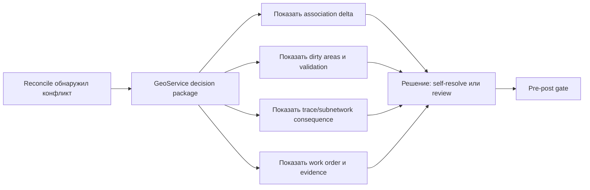

# Release 2 GeoService для уверенного решения по utility network conflict

Отвечаю как архитектор корпоративных utility GIS и эксплуатационных цифровых двойников. По загруженному файлу полезно исходить из того, что речь идет не о «еще одном редакторе карты», а об enterprise-сценарии для авторитетной сетевой модели с branch versioning, reconcile/post, конфликтами и handoff между офисом и полем. На этом фоне Release 2 стоит формулировать не как замену native GIS workflow, а как узкий, но очень ценный слой: собрать **сетевое последствие конфликта** в один decision package так, чтобы Editor или Reviewer могли принять уверенное go/no-go решение без лишних внешних проверок перед post. Именно такого слоя не дает стандартный ArcGIS conflict workflow сам по себе: Conflicts view хорошо показывает Current, Target и Common Ancestor по атрибутам и геометрии, но association context, trace-consistency, dirty areas и subnetwork status живут в соседних инструментах. fileciteturn0file0 citeturn25view0turn24view0turn27view3turn28view0

## Какая польза должна быть видна сразу

Главная польза, которую должно быть видно **без расчета денег**, — это **меньше внешних проверок и быстреее уверенное go/no-go решение**. Это сильнее и понятнее, чем обещание «лучше audit» или «меньше unsafe post risk», потому что стандартный ArcGIS workflow уже дает сравнение Current/Target/Common Ancestor и просмотр геометрии, но не собирает в одном месте association delta, dirty areas, trace consistency и subnetwork status. Если Release 2 реально нужен, пользователь должен за 1–2 минуты понять: что именно изменилось, какие сетевые последствия вообще возможны, что еще невалидно, и какой следующий безопасный шаг — self-resolve, send to review или stop before post. citeturn25view0turn25view1turn24view0turn27view3turn28view0

Второй по силе видимый эффект — **лучше audit**, но здесь важно не путать видимость ценности с доказанным эффектом. Это направление действительно важно, потому что ArcGIS прямо предупреждает: при повторном reconcile или post история conflict resolutions удаляется, а unreviewed conflicts могут быть автоматически разрешены по текущей настройке reconcile. Поэтому, если GeoService хочет быть не «экраном поверх конфликта», а слоем принятия решения, ему нужен собственный сохраняемый audit object, а не надежда на то, что native history сохранит reasoning. citeturn25view2turn25view3turn26view3

Третий эффект — **снижение риска unsafe или stale post** — годится как внутренняя гипотеза продукта, но пока не как сильный публичный claim. Официальные ArcGIS документы подтверждают, что dirty areas, unvalidated topology и validate consistency уже влияют на корректность trace и subnetwork state, а post после reconcile неотменяем. Но из этого еще не следует автоматически, что именно ваш UX уже «снижает unsafe posts» без реальных пользовательских наблюдений. До такой валидации корректнее говорить: «помогает раньше увидеть blockers и сетевое последствие». citeturn27view3turn15view3turn28view0turn26view2

Если оставить **только одну причину** для Release 2, то она будет такой: **сократить путь от обнаруженного geometry/association conflict до доверенного решения о post**, не заставляя человека вручную склеивать несколько окон ArcGIS и внешние согласования. Это лучше всего совпадает и с файлом, и с тем, как branch versioning в utility-сценариях опирается на work orders, отдельные стадии QA/QC и protected default. fileciteturn0file0 citeturn26view0turn26view1turn17view0

## Где feature должна появиться в workflow

Первое появление feature я бы ставил **сразу после reconcile и до review/post**, а не как отдельный conflict dashboard. Причина практическая: branch version conflicts формально обнаруживаются на reconcile; дальше пользователь идет либо в Conflicts view, либо к post. При этом dirty areas пересоздаются и наследуются при reconcile, trace на грязной топологии может дать неожиданный результат, а во время post могут появиться новые конфликты, если Default уже изменился после reconcile. Значит, самая полезная точка входа — не «еще одна домашняя страница конфликта», а **decision package, который открывается именно в тот момент, когда конфликт уже есть, но irreversible post еще не произошел**. citeturn16view0turn17view0turn27view1turn26view3

Отдельный dashboard имеет смысл позже, когда нужно управлять очередью конфликтов, маршрутизацией и SLA. Но для первого релиза это почти наверняка преждевременно. В официальной модели branch versioning сам work unit уже организован вокруг named version, work order, reconcile, review и post; значит, лучший MVP-паттерн — быть **встроенным шагом внутри существующего жизненного цикла версии**, а не пытаться с первого дня стать параллельной системой. citeturn26view0turn16view1turn16view0

## Какие роли и интеграции нужны

Минимальный operating model для такого слоя я бы зафиксировал так. **Utility-network admin или GIS lead** настраивает rule base, association roles, subnetwork policy, доступ к protected default и общую version strategy. **Reviewer или QA/QC-роль** подтверждает risk tier и принимает решение по конфликту в рамках стадии review. **Владелец authoritative data** или делегированный version administrator должен быть владельцем финального audit object и права финального post в защищенном контуре. Это не буквальная терминология ArcGIS, а продуктовая интерпретация поверх официальной модели, где work orders проходят стадии, администратор может брать ownership для QA/QC, protected default ограничивает post, а network rules и subnetwork policy централизованно управляются от authoritative слоя. citeturn26view0turn26view1turn23view0turn28view1

Для убедительного demo обязательны такие интеграции. **Associations** обязательны, потому что они описывают connectivity, containment и structural attachment, при этом сами ассоциации не имеют Shape и вынуждают пользователя ходить в отдельные механизмы просмотра. **Dirty areas и validation** обязательны, потому что невалидированная топология делает analytic operations ненадежными. **Trace и subnetwork status** обязательны, потому что именно они переводят конфликт из «визуального diff» в сетевое последствие и показывают invalid/dirty state. **Work order context** обязателен хотя бы на уровне ID, stage и linked assets, потому что branch version workflows в utility-сценариях строятся как discrete work units, а соседние utility-platform class решения тоже завязаны на работу с work/work order management. **Field evidence** желательно показывать уже в первом demo, но полноценная интеграция с полевой системой не обязательна: на первом rollout достаточно synthetic attachment или field note, если он привязан к конфликтному пакету. citeturn24view0turn24view2turn27view1turn27view3turn15view3turn28view0turn26view0turn19view1turn19view4

Явно **не нужны** в первом rollout полная замена native ArcGIS conflict editor, собственный topology engine, двусторонняя живая интеграция с ERP/EAM/OMS/ADMS, полноценный mobile/offline stack, batch review queue и SLA orchestration. Стандартный ArcGIS уже умеет reconcile/post, Current/Target/Common Ancestor, просмотр конфликтной геометрии, dirty areas, trace и subnetwork operations; соседние платформы вроде Bentley, Cityworks и NextGIS показывают, насколько быстро scope может расползтись в work management, enterprise integration и general-purpose platform. Поэтому MVP должен быть **decision-support поверх native authoritative workflow**, а не попыткой заменить его целиком. citeturn25view0turn16view0turn27view3turn28view0turn19view1turn19view3turn21view1

## Какой риск самый дорогой и кто может заблокировать внедрение

Самый дорогой риск внедрения — не «непонятный UI» и даже не «стало больше экранов», а **ложная уверенность**, когда explanation или risk tier расходятся с authoritative topology и trace evidence. Это особенно дорого в utility network, потому что dirty areas и missing validation уже официально означают, что analytic results, включая trace, могут расходиться с тем, что пользователь видит на карте, а post в default-version после reconcile — неотменяем. Если такой слой ошибочно скажет «safe», он создаст вредоносную уверенность именно в той точке, где цена ошибки максимальна. citeturn27view3turn15view3turn28view0turn26view2

На практике первым, кто может заблокировать внедрение даже при красивом demo, скорее всего будет **utility-network admin или GIS lead**, потому что именно у него контроль над rules, protected default, version permissions и policy обновления subnetworks. Второй по силе блокер — **владелец authoritative data или operations**, если продукт не может убедительно показать, откуда взялся вывод и чем он подтвержден. **IT/security** тоже может стать стоп-фактором, но обычно это уже следующий уровень проблемы; его шанс заметно снижается, если у вас есть self-hosted/on-prem story и вы не требуете выносить чувствительные геоданные наружу. citeturn23view0turn26view1turn28view1turn21view1

## Как должен выглядеть support package и какое обещание допустимо

После запуска нужен не просто demo script, а полноценный **support package**. В него я бы включил: фиксированный demo-сценарий; набор fixtures с ожидаемым исходом; troubleshooting по dirty areas, stale reconcile и invalid subnetwork; calibration notes по risk tiers; примеры audit objects; known limitations; и отдельный negative fixture, где решение намеренно блокирует post. Такая форма поддержки оправдана тем, что в native branch conflict workflow history of conflict resolutions удаляется после reconcile/post, а review может растягиваться на несколько сессий. Значит, ваш слой обязан не только объяснять решение, но и сохранять его след отдельно от ephemeral conflict state. citeturn25view3turn25view2turn16view0turn26view0

Минимальный audit object я бы проектировал как отдельную сущность с такими полями: version/work order reference, Current/Target/Common Ancestor snapshot reference, association delta summary, dirty area and validation state, trace/subnetwork evidence snapshot, reviewer decision, reason text, stale/reopened event, final post outcome. Часть этих полей напрямую вытекает из native ArcGIS представлений конфликтов, dirty areas и subnetwork lifecycle; часть — уже продуктовая надстройка, которая нужна именно потому, что native conflict history не сохраняет полноценный decision rationale. citeturn25view0turn27view1turn28view1turn25view3

До real user validation допустимы обещания уровня: **«собирает конфликтный контекст в один decision package»**, **«помогает раньше увидеть blockers перед post»**, **«снижает необходимость открывать дополнительные окна и проверки в простых кейсах»**, **«предназначен для consequence-first review поверх native GIS workflow»**. Слишком сильными будут claims вида: **«снижает unsafe posts»**, **«ускоряет review на X%»**, **«заменяет ArcGIS Conflicts view»**, **«гарантирует safety of post»**. Официальные документы Esri подтверждают поведение topology, dirty areas, trace consistency и reconcile/post, но не дают оснований автоматически приписывать вашей UX-надстройке измеримый бизнес-эффект без наблюдения за реальными Editors/Reviewers. citeturn25view0turn24view0turn27view3turn26view3

## Какой rollout выбрать и как доказать, что это не красивая обертка

Для **первого rollout-сценария** я бы выбрал **один canonical transformer terminal case** как главный demo и **один stale/pre-post failure case** как обязательный sidecar. Причина в том, что ArcGIS сам использует пример со связью линии, midspan tap и high-side terminal трансформатора, где trace проходит через association; это отличный кейс, чтобы показать: конфликт касается не просто «картинки линии», а пути прохождения сети и, следовательно, authoritative behavior. Если стартовать сразу с полным набором Normal/High/Critical/stale, есть риск начать с таксономии раньше, чем доказана базовая ценность. Сначала нужен один неоспоримый кейс, который демонстрирует семантический risk beyond geometry. citeturn23view1turn23view3turn24view1turn15view3

Чтобы доказать, что GeoService — не просто «красивая обертка над Conflicts view», demo должен показать **разницу в пути к решению**, а не просто новый экран. Baseline ArcGIS уже умеет сравнивать geometry и attributes как Current/Target/Common Ancestor. Но associations живут в отдельной internal table и не имеют Shape; их просмотр выполняется через Modify Associations, Select Associated Data, diagrams или synthetic geometry в trace. Dirty areas, Validate Consistency и subnetwork invalid/dirty state — это тоже соседние механизмы. Следовательно, GeoService выигрывает только если в одном пакете отвечает на четыре вопроса: **что конфликтует**, **какое сетевое поведение этим может измениться**, **что сейчас мешает safe post**, и **какой следующий шаг безопасен**. Если пользователь все равно открывает внешний GIS, trace tool, notes и устные согласования в том же объеме, значит вы добавили экран, а не сократили путь. Лучший показатель победы над baseline — наблюдаемое уменьшение external tool opens, screenshots/notes и time-to-confident-decision в тестовых сессиях. citeturn25view0turn25view1turn24view0turn24view2turn27view3turn28view0

Итоговая рекомендация проста: **Release 2 нужен не ради routing как такового и не ради «AI explanation» как красивой идеи, а ради одного конкретного результата — превратить geometry/association conflict в короткий, доказуемый, consequence-first decision package перед post**. Если demo показывает именно это, он выглядит как следующий логичный слой над native utility GIS. Если нет, он действительно рискует оказаться просто более красивым Conflicts view. fileciteturn0file0 citeturn17view0turn24view0turn27view1turn26view0
