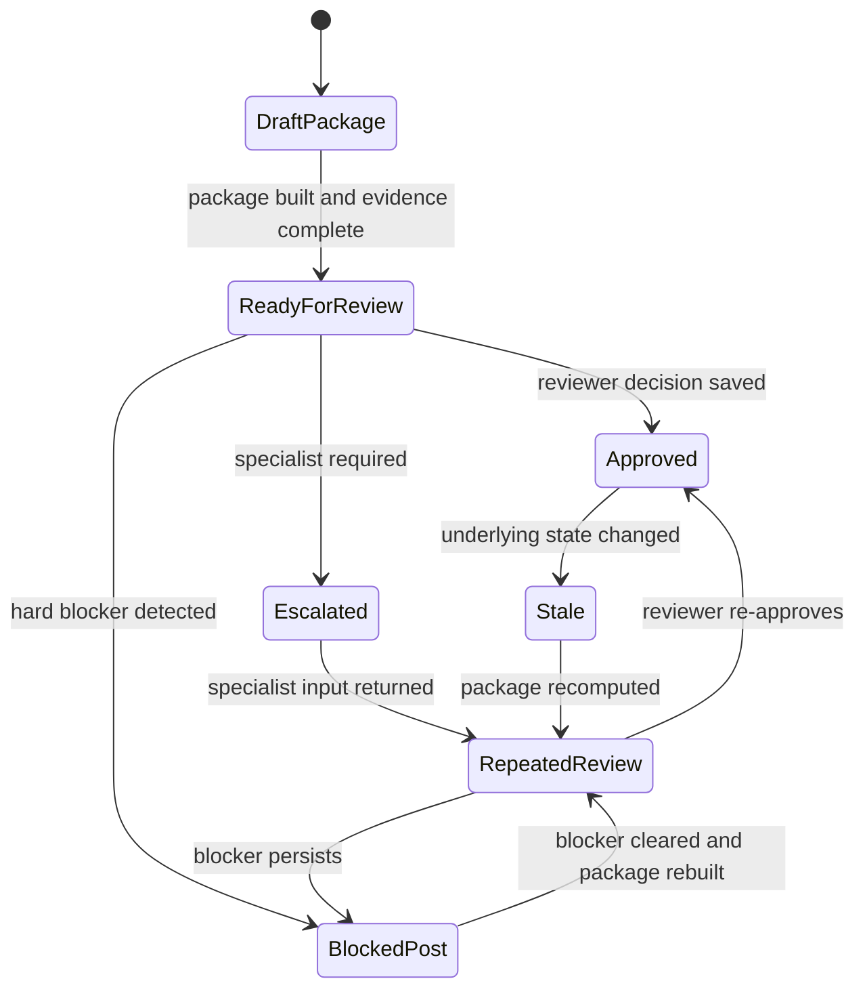

# Release 2 conflict package для geometry и association conflict

Отвечаю как архитектор корпоративных ГИС для инженерных сетей, который проектирует versioned utility editing workflow, review gates и auditability для authoritative network model.

В загруженном файле utility GIS editor трактуется не как обычный редактор карты, а как редактор **авторитетной сетевой модели** с branch versioning, reconcile/post, конфликтами, полевыми материалами и эксплуатационным контекстом. Это важно, потому что для Release 2 ваш demo должен доказывать не «красивый diff», а **безопасность решения перед post** в условиях версионности, топологии, associations, traces и subnetwork semantics. Именно так я ниже и формулирую implementation contract: как слой consequence-first decision support над native workflow, а не как замену ArcGIS Conflicts view. fileciteturn0file0 citeturn7view1turn22view0turn22view1

## Что обязательно должно быть в первом conflict package

Для первого demo я бы сделал обязательным **не весь возможный контекст**, а только тот минимум, без которого нельзя честно ответить на вопрос: «это безопасно решать и можно ли двигаться к post?». На уровне branch version conflicts ArcGIS уже задает правильную тройку представлений: **Current**, **Target** и **Common Ancestor**, то есть по сути **Mine / Default / Base**. Без этой тройки у вас нет надежного объяснения, кто что изменил и от какого общего состояния конфликт возник. Поэтому Base, Mine и Default должны быть обязательной частью первого package, а не nice-to-have. citeturn25view0turn7view1

Обязательный состав первого package я рекомендую таким. Во-первых, **Base / Mine / Default** как три состояния объекта или набора объектов в конфликте. Во-вторых, **geometry diff**, потому что ArcGIS Conflicts view отдельно показывает сравнение геометрии между версиями. В-третьих, **association delta**, потому что в utility network associations моделируют connectivity, containment и structural attachment, а сами association не живут как обычная shape-геометрия, то есть их нельзя безопасно «додумать» по одному визуальному overlay. В-четвертых, **dirty areas** и их статус, потому что именно они показывают, какие изменения еще не отражены в network topology и где аналитика может быть ненадежной. В-пятых, **validation status / network errors**, потому что errors возникают при validate topology и update subnetwork, когда нарушены rules и restrictions. В-шестых, **trace evidence** для affected path, если вы вообще заявляете network consequence; без trace consequence-first explanation превращается в эвристику. В-седьмых, **subnetwork status** только тогда, когда конфликт затрагивает controller, feeder, tier boundary или атрибуты, влияющие на subnetwork semantics. Work order и field evidence полезны, но для самого доказательства сетевого последствия они вторичны и могут идти как contextual evidence, а не как core evidence. citeturn25view0turn14view0turn5view0turn22view1turn15view2turn16view1turn17view0turn27view1

Отсюда следует полезное разграничение между тем, что можно имитировать fixture-данными, и тем, что должно вычисляться из текущей модели. **Можно имитировать**: work order metadata, field evidence, attached photos, reviewer comments, escalation note, human-readable risk rationale, а также narrative summary кейса — это всё относится к операционному контексту и не меняет authoritative state само по себе. **Нужно вычислять из текущей модели**: Base/Mine/Default triple, geometry diff, association delta, dirty areas, validation result, network errors, validated trace result, subnetwork status, current version moments и stale conditions. Причина простая: dirty areas создаются именно edit-изменениями, включая geometry, associations, network attributes и terminal configuration; trace и subnetwork validity зависят от актуального topology state, а не от статического fixture. Если trace показывается как evidence безопасности, он должен быть либо вычислен сейчас, либо быть заранее предвычисленным для **замороженного canonical dataset с контрольной версией и checksum**, а это уже отдельный режим demo-fixture, который надо явно маркировать как frozen replay. citeturn5view0turn22view0turn16view1turn17view0turn27view2

Если выбирать **один canonical scenario** для первого demo, я бы брал именно **transformer terminal / service-device connectivity case**, а не абстрактный line-on-line conflict. Esri прямо показывает пример, где junction-edge connectivity rule для линии и устройства с terminals, плюс ассоциация к high-side terminal трансформатора, меняют то, как trace проходит по сети. Это очень сильный demo-сценарий, потому что он быстро объясняет, почему простой geometry diff недостаточен: в utility network значение имеет не только линия на карте, но и terminal-aware connectivity. citeturn15view0

## Что можно считать границей первого demo

Граница MVP для Release 2 должна быть максимально жесткой: **read-only package + consequence explanation + blocker verdict + audit write**, но не полный replacement native conflict resolution. Иначе вы очень быстро скатитесь в переписывание ArcGIS editor workflow, а не в демонстрацию ценности consequence package. Файл тоже задает правильную стратегию: продукт нужно строить как operational utility GIS слой вокруг authoritative network model и workflow, а не как еще один generic editor. fileciteturn0file0

Практически это означает следующее. В первом demo UI должен уметь открыть package, показать Base / Mine / Default, geometry diff, association delta, dirty areas, validation/error state, trace/subnetwork consequence, а затем выдать только **safe next step**: `self-resolve in native GIS`, `send to reviewer`, `block post`, `escalate to specialist`. Кнопки реального reconcile/replace/post можно оставить вне scope или спрятать за stub, потому что native ArcGIS уже умеет field-level replacement, feature replacement, layer-level replacement и даже merge geometries для Shape conflicts. Ваша ценность не в дублировании этих действий, а в том, чтобы до них правильно объяснить сетевое последствие и отфильтровать false-safe decisions. citeturn26view0turn26view1turn25view0

На этом основании ответ на вопрос «достаточно ли одного canonical transformer terminal scenario и одного stale / pre-post failure sidecar?» такой: **для developer demo — да, достаточно; для продуктового acceptance — нет, недостаточно**. Один transformer-terminal case доказывает, что associations и terminals влияют на trace и что geometry-only view вводит в заблуждение. Один stale/pre-post sidecar доказывает, что даже после reconcile/approval состояние может устареть, потому что post может обнаружить новые конфликты, если Default успел измениться между reconcile и post. Но этих двух сценариев мало, чтобы откалибровать routing между Normal/High/Critical или обещать снижение review friction на реальных редакторах. citeturn15view0turn7view1turn25view1

## Какие состояния обязательны в state machine и что делает package stale

Минимальная state machine для Release 2, на мой взгляд, действительно должна включать состояния **draft package**, **ready for review**, **approved**, **stale**, **blocked post**, **escalated** и **repeated review**. Это не избыточность, а прямое отражение branch-versioned reality: сначала package собирается, потом становится reviewable, потом либо утверждается, либо блокируется, либо уходит на эскалацию; после любого изменения underlying state approval может устареть, и тогда нужен повторный review. ArcGIS подтверждает три ключевых вещи, которые требуют именно такой модели: reconcile выявляет conflicts; post может снова обнаружить conflict, если Default изменился после reconcile; unresolved conflicts прерывают posting; а conflict-resolution history не живет вечно — second reconcile или post очищает unreviewed conflicts и удаляет историю resolutions. citeturn7view1turn25view1turn26view1turn26view2turn26view3

События, которые должны инвалидировать package или approval, тоже можно перечислить довольно жестко. **Обязательно stale** при любом новом изменении в named version, которое создает dirty area в affected scope: это geometry, asset group/type changes, network attributes, associations и terminal configuration. Это следует напрямую из того, какие операции создают dirty areas. **Обязательно stale** после reconcile, если в named version подтянулись новые изменения из Default. **Обязательно stale** перед post, если с момента последнего reconcile Default снова изменился: ArcGIS в таком случае требует reconcile again before posting. **Обязательно stale** после validate topology, если validate выполнен после reconcile: ArcGIS прямо пишет, что после validate following reconcile another reconcile is required before post. **Обязательно stale** после update subnetwork, если package опирался на прежний subnetwork status или trace evidence, потому что update subnetwork меняет status, propagated values и editor-tracked records. И наконец, **обязательно stale** после изменения risk-relevant evidence: trace path, blocker set, subnetwork status, error set, association delta. citeturn5view0turn22view0turn7view1turn17view0turn27view2turn27view0

Отсюда и важный практический вывод для repeated review: в UI не надо заставлять reviewer заново читать весь package без необходимости. Лучший режим — показывать **delta since approved state** как первый экран, но с возможностью открыть **full package snapshot**. Это уже мой продуктовый вывод, однако он логично опирается на то, что branch versioning хранит modified, reconciled, common ancestor moments и полный исторический след правок, а conflict context может исчезнуть при следующем reconcile/post. Иначе reviewer теряет рабочую память, а audit trail становится хуже. citeturn27view0turn25view3turn26view1

## Какие hard post blockers должны войти в implementation contract

Здесь важно различать **native ArcGIS blocker** и **GeoService safe-post blocker**. Native ArcGIS blocker однозначно включает **unresolved conflicts** и **new conflicts discovered during post**, потому что post будет interrupted и потребует нового reconcile. Это должно быть отражено в contract без оговорок. citeturn25view1turn7view1

Дальше идут blockers, которые ArcGIS не всегда блокирует технически, но которые ваш Release 2 должен блокировать продуктово, если он обещает consequence-first safe-post decision. Первый такой blocker — **error dirty areas / network errors** в affected scope. Errors появляются из-за violations of rules and restrictions, остаются до исправления и означают, что часть сети находится в invalid condition. Второй — **dirty areas on the claimed trace path** или inability to run trace with Validate Consistency, потому что ArcGIS прямо предупреждает: trace without validated consistency can produce unexpected results, а при включенном Validate Consistency trace должен fail, если dirty areas intersect the path. Третий — **dirty or invalid affected subnetwork**, если кейс вообще ссылается на feeder, controller, subnetwork name или downstream effect. Update subnetwork переводит status между Dirty, Clean и Invalid; если affected subnetwork invalid or dirty, нельзя честно говорить о safe post consequence. Четвертый — **unresolved association delta** на объектах, от которых зависит connectivity, containment, structural attachment или locatability. Associations не являются обычной геометрией, но влияют на trace path и на locatability nonspatial objects, поэтому package без финализированной association delta — это неполное доказательство. citeturn15view2turn16view1turn17view0turn27view1turn14view0turn27view3

Отдельно подчеркну неприятный, но важный нюанс: **dirty areas сами по себе после reconcile не всегда блокируют native post**. ArcGIS прямо пишет, что validation after reconcile is not required and post can complete with dirty areas present. Но для вашего Release 2 это не означает, что dirty areas можно игнорировать. Если package претендует на объяснение network consequence, а trace or subnetwork evidence затрагивает dirty scope, то такой package должен уходить в `blocked post` или `stale`, иначе вы получите самый опасный класс ошибки — **false-safe verdict**, когда интерфейс говорит «можно постить», хотя topology/trace basis фактически не подтверждены. citeturn25view1turn16view1turn22view1

Неприемлемым false-safe результатом в developer demo я бы считал любой из трех случаев. Первый: package показывает `safe to post`, хотя в affected scope есть unresolved conflicts или post-time re-reconcile is already required. Второй: package показывает `no network consequence`, хотя validated trace fails, dirty areas intersect the path или subnetwork is invalid/dirty. Третий: package скрывает unresolved association delta и делает вывод только по geometry diff, хотя associations задают connectivity/containment/attachment semantics. Такой demo лучше честно провалить, чем «выиграть» за счет ложной безопасности. citeturn7view1turn25view1turn16view1turn17view0turn14view0

## Какой минимальный audit object нужен для Ф6

Минимальный audit object для Ф6 не должен быть большим, но он обязан фиксировать **решение и основание решения** так, чтобы спустя время можно было восстановить и состояние версии, и evidence snapshot. Branch versioning уже имеет temporal insert-only history и аудитопригодный исторический след изменений через специальные system fields; кроме того, ArcGIS conflict workflow поддерживает review notes и reviewed/unreviewed status. На этом фоне для вашего объекта аудита я бы зафиксировал не меньше следующего. citeturn25view3turn26view1

Во-первых, идентификаторы: `package_id`, `version_name`, `version_owner`, `feature_service`, `conflict_ids`, `affected_asset_ids`. Во-вторых, reference moments: `created`, `modified`, `reconciled`, `common_ancestor`, а для subnetwork-sensitive кейсов еще `last_update_subnetwork` и `subnetwork_status`. В-третьих, evidence snapshot refs: ссылки или hashes на Base/Mine/Default diff, association delta, dirty area sample, validation result, trace result, subnetwork status, work order/field evidence used. В-четвертых, decision block: `risk_tier`, `hard_blockers[]`, `reviewer_decision`, `rationale`, `review_note`, `escalated_to`, `resolved_by`. В-пятых, stale block: `stale=false/true`, `stale_reason`, `stale_trigger_event`, `recomputed_from_package_id`. В-шестых, final outcome: `posted=true/false`, `post_time`, `post_result`, `reconcile_required_before_post=true/false`. Такой минимальный объект уже позволяет доказать who decided what, on what evidence, and against which version moment. citeturn27view0turn27view2turn25view3turn26view1

Важно отдельно записывать не только счастливый путь, но и **stale events**. Это связано с тем, что branch workflows меняют референсный момент при reconcile, а повторный reconcile/post очищает старую conflict-resolution history. Если stale событие не зафиксировано в вашем audit object, вы потом не докажете, почему прежнее approval перестало быть валидным. Поэтому в implementation contract stale log должен быть обязательным, а не nice-to-have. citeturn26view2turn26view3turn27view0

## Какие API, events, P95 targets и observability нужны в первом rollout

Для первого demo я бы сделал обязательными только те внешние API, которые нужны UI, а все тяжелые ArcGIS-specific операции оставил за внутренним orchestration слоем. Снаружи достаточно иметь: `GET package summary`, `GET package details`, `POST recompute package`, `POST reviewer decision`, `GET audit record` и `GET package status` либо push-канал для stale/blocker/job updates. Если demo уже включает pre-post gate, добавьте `POST pre-post check`, но не пытайтесь в первом же релизе внешне публиковать raw-операции reconcile/validate/trace/update subnetwork как user-facing API вашего сервиса. Это полезнее держать как internal service calls, которые вы можете менять без поломки клиентского контракта. Такой разрез хорошо согласуется и с файлом, где utility editor трактуется как orchestration над workflows и integrations, а не как замена нативной платформы. fileciteturn0file0

Во внутренний слой я бы поместил: adapter к Version Management и конфликтным представлениям, diff normalizer для Base/Mine/Default, association extractor, dirty area / validation reader, trace executor, subnetwork-status reader, risk-tier classifier, stale detector, audit writer и demo-fixture resolver. Это уже архитектурная рекомендация, но она прямо вытекает из того, что validate topology и traces могут идти через long-running or asynchronous server-side operations, а branch version workflow живет в отдельных service capabilities и version moments. citeturn22view0turn15view1turn18view0

По P95 targets я бы не обещал «молниеносность» для тяжелых операций, а разделил UX на три класса. **Открытие готового package summary** — P95 до 2 секунд. **Открытие evidence details** — P95 до 2.5 секунд. **Решение stale/check block status из уже рассчитанных сигналов** — P95 до 1 секунды. **Audit save** — P95 до 1 секунды на ACK и до 3 секунд на последующую читаемость в UI. Всё, что требует пересчета trace, validate или update-subnetwork-sensitive evidence, должно уходить в async job с прогрессом; это соответствует тому, что ArcGIS использует asynchronous processing для longer-running validate operations и поддерживает asynchronous trace mode по server-side geoprocessing service. Поэтому разумный контракт не в том, чтобы Trace всегда укладывался в 1 секунду, а в том, чтобы UI почти сразу показывал `job accepted`, `job stage`, `freshness moment`, `safe/unsafe to reuse cached evidence`. citeturn22view0turn15view1

Для observability этого package вам нужны не просто generic logs, а несколько конкретных сигналов. Обязательно логируйте `package_build_duration_ms`, `diff_extraction_ms`, `association_read_ms`, `dirty_area_fetch_ms`, `trace_job_ms`, `subnetwork_status_fetch_ms`, `audit_save_ms`, `stale_detection_ms`; `trace_consistency_failures`, `subnetwork_invalid_count`, `hard_blocker_count`, `package_recomputed_count`, `approval_staled_count`; а также source-of-truth moments: `version_modified`, `version_reconciled`, `common_ancestor`, `subnetwork_last_update`, `package_computed_at`. Эти поля нужны не только для debug, но и для trust: reviewer должен видеть, насколько evidence свежее относительно version state. ArcGIS уже делает modified, reconciled, common ancestor и subnetwork status first-class properties, и это хороший ориентир, какие timestamps должны быть в вашем telemetry payload. citeturn27view0turn27view2turn27view1

## Какие support, security и future ADR ограничения стоит зафиксировать сразу

Support package для первого rollout должен включать не только demo script, но и **данные для воспроизводимости**. Минимально нужны: frozen canonical dataset, fixture work order, field evidence examples, expected Base/Mine/Default snapshots, expected association delta, expected dirty-area/error cases, expected trace outputs, expected subnetwork statuses, stale sidecar script, audit examples, troubleshooting tree и calibration notes по тому, какие результаты считаются safe, blocked и stale. Без такого support package команда быстро перестанет различать «сломался demo» и «изменилась underlying network state». fileciteturn0file0 citeturn25view3turn27view0turn27view2

С точки зрения security и access constraints сверх текущих Editor/Reviewer я бы сразу заложил четыре вещи. Первая — **protected default** как целевой operating mode, если никто не должен редактировать Default напрямую; Esri прямо рекомендует в таком сценарии ограничить редактирование и posting to default только version administrators. Вторая — **separation of capabilities**: Editor и Reviewer могут читать package и сохранять review, но право на actual post должно оставаться у version administrator или отдельного publishing role. Третья — **immutable audit write**: Reviewer может добавлять решение и rationale, но не должен переписывать исторические записи задним числом. Четвертая — **scoped access to field evidence/work orders**, потому что операционные вложения и рабочие задания часто живут в отдельных системах и не всегда должны быть полностью видны всем, кто видит геометрический конфликт. citeturn18view0turn25view2

И наконец, есть набор ограничений, которые стоит сразу записать как **future ADR candidates**, чтобы не раздувать Release 2. Я бы вынес туда: собственный topology engine, глубокую external GIS integration beyond current authoritative source, batch review queue, SLA orchestration, object storage strategy для evidence snapshots, полноценное on-prem/security hardening, multi-scenario routing calibration и production-grade specialist workflow. Это не потому, что они не важны, а потому, что их ценность нельзя честно доказать раньше, чем вы докажете базовую гипотезу Release 2: package действительно сокращает путь к уверенному safe/unsafe решению на canonical utility conflict. fileciteturn0file0

В одном предложении: **для первого demo package должен вычисляемо доказать текущее сетевое последствие конфликта на основе Base/Mine/Default, association delta, dirty/validation/trace/subnetwork signals, жестко инвалидироваться при изменении version state и оставлять минимальный, но полноценный audit trail; всё остальное пока вторично**. fileciteturn0file0 citeturn25view0turn5view0turn16view1turn17view0turn7view1turn25view3
