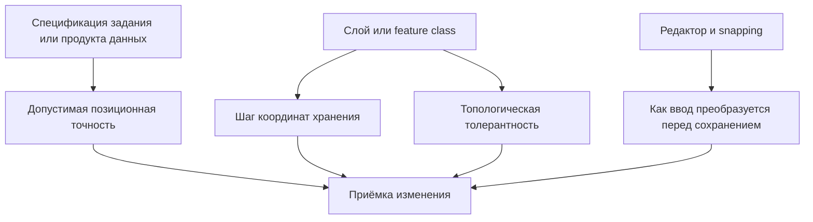

# Правила точности, повторного сохранения и подтверждения изменений для редактора инженерной сети

*Отвечаю как архитектор корпоративных ГИС и систем версионированного редактирования инженерных сетей, который проектирует правила для utility network, branch versioning, offline sync и аудита изменений.*

Загруженный файл описывает роль, работающую не с «обычной картой», а с **авторитетной моделью инженерной сети**, где важны версии, reconcile/post, контроль топологии, обмен между офисом и полем и разбор конфликтов. В такой среде неоднозначные правила точности координат, повторного сохранения и фиксации исходного состояния действительно приводят к тому, что одна и та же правка трактуется по-разному в разных этапах одного процесса. Именно поэтому ниже я разделяю две вещи, которые часто смешивают: **допустимую пространственную точность как требование к данным** и **числовую точность хранения/квантования координат в конкретном слое или базе**. Эти две сущности задаются разными источниками и должны быть разведены в ТЗ явно. fileciteturn0file0 citeturn7search0turn2search15turn2search1turn1search4turn0search5

## Что считать источником истины

Главный вывод по доменной области такой: **источник допустимой точности как бизнес-требования — это спецификация продукта данных или конкретного задания**, а не сама по себе территория, тип линии или редактор. ISO 19131 описывает именно **data product specification** как место, где формулируются требования к геоданным; ISO 19157 задаёт принципы описания и оценки качества данных относительно спецификации продукта; FGDC NSSDA прямо говорит, что сам стандарт даёт методику тестирования и отчётности, но **не задаёт обязательные пороги pass/fail**, и рекомендует устанавливать такие критерии в продуктовых стандартах, приложениях и контрактах. Из этого следует простое правило: если в вашей организации нужно однозначно отвечать на вопрос «какая точность допустима для этой линии», то такой ответ должен браться **из утверждённой спецификации задания/набора данных**, а не выводиться «по умолчанию» из геометрии, территории или мнения редактора. citeturn7search0turn2search15turn2search1

Одновременно **числовая точность записи координат** определяется уже не ТЗ на работу, а настройками конкретного слоя или хранилища. В ArcGIS координаты хранятся на внутренней координатной сетке, которую задаёт `XY Resolution`; `XY Tolerance` определяет минимальное расстояние, при котором координаты считаются совпадающими в реляционных и топологических операциях. В QGIS для слоя может задаваться `Geometry precision distance`, при котором добавленная или изменённая геометрия автоматически привязывается к ближайшим узлам сетки. Поэтому в инженерной системе нужно всегда фиксировать **двухуровневую иерархию**: сначала требования к качеству данных на уровне задания, затем правила хранения и топологической интерпретации на уровне слоя/БД. citeturn1search4turn0search5turn0search6turn12search0

Для практического ТЗ я рекомендую записать источник истины так: **«Допустимая позиционная точность берётся из спецификации задания/продукта данных; точность хранения и сравнения координат — из настроек слоя/feature class; различия по типам линий, территориям и видам работ действуют только если они прямо описаны в спецификации»**. Это и будет тем единым правилом, которого сейчас не хватает. citeturn7search0turn2search1turn1search4turn0search5

## Точность координат линии

Если отвечать на первый блок вопросов максимально строго, то **для приёмки правки линии решающим источником должна быть спецификация задания или продукта данных**, а не автоматически выбранный тип линии, территория или «вид работ» вне этой спецификации. При этом тип линии, территория и вид работ вполне могут влиять на допустимую точность, но только как **условия, формализованные в той же спецификации**. Иначе один и тот же объект будет оцениваться по разным неявным правилам, что противоречит как логике стандартов качества геоданных, так и логике авторитетной сетевой модели из вашего файла. fileciteturn0file0 citeturn7search0turn2search15turn2search1

Эталонный пример можно зафиксировать так. Если в спецификации работ написано: «для подземных кабельных линий в городской зоне горизонтальная позиционная точность должна быть не хуже 0,20 м», то **именно эта формулировка** является источником допустимой точности для приёмки правки; если те же линии хранятся в ArcGIS feature class с дефолтной `XY Resolution = 0,0001 м` и `XY Tolerance = 0,001 м`, то это уже не бизнес-норма приёмки, а числовой режим хранения и топологического равенства координат. То есть 0,20 м отвечает на вопрос «достаточно ли точны данные для задачи», а 0,0001/0,001 м — на вопрос «как именно координаты будут храниться и считаться совпадающими в системе». citeturn2search1turn1search4turn0search5turn0search2

На вопрос, одинакова ли точность для всех линий сети, правильный ответ двусоставный. **Внутри одного и того же слоя или feature class точность хранения обычно едина**, потому что её задают свойства пространственной ссылки или точностная сетка слоя. **Но допустимая позиционная точность для приёмки не обязана быть одинаковой для всех линий сети**: она может различаться по классу объекта, территории, способу съёмки, типу работ или договору, если это явно предусмотрено спецификацией. FGDC NSSDA как раз исходит из того, что пороги пригодности задаёт приложение/контракт, а не сама методика; в QGIS правила точностной сетки, snapping и topological editing могут задаваться по слоям. citeturn2search1turn12search0turn8search1

Ниже — удобная рабочая таблица, которую можно почти напрямую превращать в требования.

| Условие | Допустимая точность | Единица | Что считать источником |
|---|---:|---|---|
| Одна и та же линия в рамках одного задания и одной спецификации | Одна и та же **позиционная** точность для приёмки | метры на местности | Спецификация задания / data product specification. citeturn7search0turn2search1 |
| Разные типы линий, если для них заданы разные классы качества | Разная позиционная точность по классам | метры на местности | Та же спецификация; различие допустимо только если оно прописано явно. citeturn7search0turn2search15turn2search1 |
| Разные территории с разной плотностью и методом съёмки | Может отличаться | метры на местности | Только если территориальные классы качества описаны в спецификации. citeturn2search1turn7search0 |
| Разные виды работ: исполнительная съёмка, камеральное уточнение, перенос из архива | Может отличаться | метры на местности | Только если вид работ описан как отдельный режим точности. citeturn2search1turn7search0 |
| Все объекты внутри одного ArcGIS feature class | Одинаковая точность хранения `XY Resolution` и логика равенства `XY Tolerance` | единицы СК слоя | Свойства spatial reference / feature class. citeturn1search4turn0search5turn0search6 |
| Все объекты внутри одного QGIS-слоя с `Geometry precision distance` | Одинаковая сетка квантования | единицы СК слоя | Digitizing properties слоя. citeturn12search0 |

На вопрос «что делать, если новая координата не соответствует установленной точности», я рекомендую правило из двух шагов. **Сначала — детерминированное приведение к канонической координате хранения**: то есть округление/привязка к ближайшему узлу разрешённой сетки хранения. Это соответствует и идее внутренней координатной сетки ArcGIS, и практике `ST_ReducePrecision`/grid snapping в PostGIS и QGIS. **Потом — обязательная проверка геометрии и топологии**. Если после приведения геометрия схлопывается, становится невалидной или ломает топологическое правило, сохранение нужно **отклонять**, а не молча «дотягивать» вершину до какого-то другого допустимого места. PostGIS прямо документирует, что снижение точности округляет точки к сетке, а операция topological precision должна лучше выбрасывать исключение, чем схлопывать ребро; QGIS предупреждает, что snapping to grid может привести к невалидной геометрии, а при невозможности расчёта snapped geometry она очищается. В ArcGIS чрезмерная tolerance может менять результат топологических операций и ухудшать точность, поэтому использовать её как скрытый механизм «автопочинки» не рекомендуется. citeturn1search9turn1search1turn12search5turn12search10turn0search5turn0search6

Рекомендуемый эталонный пример я бы записал так: если шаг координат хранения равен **0,001 м**, а редактор ввёл вершину в `100,1237; 200,9874`, то в хранилище должно попасть `100,124; 200,987`; если же после такого приведения двусегментная линия `[(0,000;0,000) – (0,0004;0,0004) – (1,000;1,000)]` теряет среднюю вершину и нарушает требуемую форму или топологию, сохранение должно быть отклонено с понятной диагностикой, а не молча «привязано» к ближайшему допустимому положению вне правила сетки. Такой режим предсказуем для редактора и воспроизводим на сервере. citeturn1search9turn12search5turn1search1

На вопрос, нужно ли приводить к точности только перемещённую вершину или всю линию, удобнее всего дать такое короткое правило: **в обычном интерактивном сохранении приводится только изменённая вершина и те вершины, которые обязаны сдвинуться из-за топологической связности; нетронутые вершины численно менять нельзя**. Основание здесь практическое: в QGIS есть режимы, где при включённой геометрической сетке или топологическом редактировании может измениться вся модифицированная геометрия или общие узлы соседних объектов; в ArcGIS during topology validation и clustering координаты в зоне tolerance тоже могут быть сдвинуты. Но именно потому, что такие изменяющие эффекты существуют, **их надо выносить в отдельные явные операции** — например, «нормализовать геометрию по сетке» или «провалидировать топологию», — а не подмешивать в обычное «сохранить правку вершины». Иначе небольшая правка действительно незаметно перепишет всю линию. citeturn12search0turn8search0turn8search3turn0search7

Пример до и после удобно зафиксировать так. До сохранения: `LINESTRING (0,000 0,000, 1,23456 1,23456, 2,000 2,000)`. Редактор потянул только среднюю вершину. После сохранения при шаге 0,001 м: `LINESTRING (0,000 0,000, 1,235 1,235, 2,000 2,000)`. Если при этом линия не состоит из общих границ и не включено топологическое редактирование, первые и последние координаты должны остаться побитово прежними. Исключение — только явно включённое topological editing/shared-node editing, где соседние общие вершины изменяются совместно. citeturn8search0turn8search3turn12search0

Если после приведения к установленной точности вершина совпала с исходной, такую правку лучше считать **отсутствием изменения**. Это не только соответствует здравой модели редактора, но и хорошо согласуется с практикой идемпотентных обновлений: HTTP-условные обновления допускают успешный ответ, если требуемое пользователем конечное состояние уже отражено в текущем состоянии ресурса; идемпотентные API должны возвращать тот же результат без повторного эффекта при повторе той же операции. Для вашей предметной области это значит: если канонизированная геометрия после сохранения побитово равна уже сохранённой канонической геометрии, не надо создавать новый смысловой change-event. citeturn9search4turn3search3turn4search7

Пограничный пример здесь такой. В хранилище уже лежит вершина `10,123` при шаге 0,001 м. Пользователь вводит `10,1234`. После канонизации это снова `10,123`. С точки зрения бизнеса и истории правок линия **не изменилась**, даже если UI может показать, что пользователь «пытался двигать вершину». Для протокола взаимодействия это no-op; для внутренней телеметрии можно сохранить лишь факт попытки, но не как успешное изменение геометрии. citeturn1search9turn9search4

## Повторное сохранение

Для сценария «подтверждение потерялось, клиент повторяет сохранение» устойчивое решение — **идемпотентное сохранение**, а не логика «только в рамках текущей сессии». IETF draft по `Idempotency-Key` описывает ключ как уникальный идентификатор, по которому сервер распознаёт повтор той же операции; срок его действия — это отдельная политика сервера, и она должна быть опубликована. AWS в своих idempotent APIs показывает тот же паттерн: тот же client token + те же параметры = тот же результат без нового эффекта; другой набор параметров с тем же токеном должен давать конфликт/ошибку; TTL у конкретных сервисов задаётся явно, например 24 часа для `RunTask`. Из этого следует, что распознавание повтора не должно зависеть от того, остался ли пользователь в текущем окне или даже на том же устройстве. citeturn4search7turn3search7turn3search6

Поэтому на ваш первый вопрос этого блока я бы ответил так: **повтор должен распознаваться как то же сохранение до тех пор, пока одновременно выполняются два условия — не истёк срок действия idempotency record и не изменилось исходное состояние линии, на которое ссылалась операция**. На практике это лучше формулировать не как «до закрытия редактора» и не как «до конца задания», а как **«до смены базового состояния линии или истечения idempotency window, что наступит раньше»**. Такой критерий переживает reconnect, reopen, мобильный offline/online цикл и не смешивает старую попытку с новой правкой. Это особенно важно для роли из вашего файла, где возможны версии, синхронизация и конфликтное редактирование. fileciteturn0file0 citeturn4search7turn3search7turn9search4turn11search7

Обязательные признаки того, что редактор повторяет **то же самое действие**, я рекомендую закрепить строго и без двусмысленности. Идентичность действия должна определяться не только «той же линией», а полным набором признаков: тем же **operation ID / idempotency key**, тем же **ID линии**, тем же **исходным состоянием** линии или версии, тем же **типом операции**, тем же **идентификатором вершины или тем же before/after диффом**, и тем же **каноническим итоговым положением после всех правил округления/сетки**. Именно такой подход соответствует и IETF-требованию не переиспользовать idempotency key с другим payload, и AWS-правилу «same token + same parameters», и версии ArcGIS, где конфликтная логика сравнивает `Current`, `Target` и `Common Ancestor`. citeturn4search7turn3search6turn11search7turn5search1

Ниже — удобный набор обязательных признаков одинакового действия.

| Признак | Обязателен | Почему |
|---|---|---|
| Идентификатор операции `operation_id` / `idempotency_key` | Да | Без него нельзя устойчиво распознать именно повтор, а не похожую новую правку. citeturn4search7turn3search6 |
| Идентификатор линии | Да | Повтор должен адресоваться тому же объекту. citeturn13search1turn10search2 |
| Исходное состояние линии / common ancestor / ETag | Да | Иначе повтор может быть применён к уже изменившемуся объекту и вызвать lost update. citeturn9search4turn11search7turn11search9 |
| Тип операции | Да | Перемещение вершины, разрезание линии и обновление атрибута — разные действия. citeturn13search1 |
| Идентификатор вершины или точный before/after diff | Да | Нужен, чтобы не спутать разные намерения на одной линии. citeturn13search1turn10search2 |
| Итоговая каноническая координата после округления/сетки | Да | Сырые введённые значения могут различаться, а сохранённое состояние совпадать. citeturn1search9turn12search0 |
| Пользователь / устройство | Нет, но полезно | Для аудита полезно, но для идемпотентности важнее operation ID и исходное состояние. citeturn13search1turn6search2 |

Если после успешного сохранения линия была изменена ещё раз, а затем пришёл запоздалый повтор первого сохранения, на пользовательском уровне лучшее поведение — **показать текущее состояние**, а не состояние первого действия и не «молча» отклонить без объяснения. Причина в том, что редактору нельзя создавать впечатление, будто более поздняя правка пропала. При этом сервер всё равно должен понимать, что повтор относится к уже завершённой операции, и не применять побочный эффект второй раз. HTTP-условные обновления как раз предназначены для защиты от lost update, а журнал конфликтов ArcGIS опирается на сравнение текущего состояния, target и common ancestor. Поэтому корректный UX-ответ здесь такой: **«первое сохранение уже было выполнено; сейчас объект имеет более новое состояние — вот текущее состояние»**. citeturn9search4turn5search1turn5search2turn3search3

Для трёх типичных сценариев восстановления работы правило удобно зафиксировать так:

| Сценарий | То же действие или новое действие |
|---|---|
| Разрыв связи, клиент повторяет запрос с тем же `operation_id`, той же линией и тем же исходным состоянием | **То же действие**. citeturn4search7turn3search7 |
| Повторный вход в систему, но клиент сохранил тот же `operation_id` и исходное состояние не изменилось | **То же действие**. Сессия не должна быть границей идемпотентности. citeturn4search7turn3search6 |
| Продолжение работы с другого устройства при переносе того же `operation_id` и того же исходного состояния | **То же действие**, если сервер хранит запись об операции и допускает этот scope. citeturn4search7turn3search3 |
| Любой из сценариев, но `operation_id` новый | **Новое действие**. citeturn4search7 |
| Любой из сценариев, но исходное состояние линии уже изменилось | **Новое действие** или конфликт, а не повтор. citeturn9search4turn11search9 |
| Повтор после истечения idempotency window | **Новое действие**. citeturn4search7turn3search7 |

## Исходное состояние сети

Для понятного пользовательского языка я бы рекомендовал термин **«базовое состояние работы»**. Он точен по смыслу и не привязывает редактора к внутренним названиям БД. В ArcGIS branch versioning техническим аналогом этого понятия выступает **common ancestor moment** — последний момент, когда именованная версия и default ссылались на одно и то же состояние. Но в интерфейсе, документации для редакторов и требованиях к бизнес-логике лучше писать именно «базовое состояние работы» или «исходное состояние работы», а технические слова `common ancestor`, `state_id`, `version lineage` оставить внутренними. Это особенно оправдано в вашей роли, где редактор работает с сетевой моделью и заданиями, а не с таблицами репозитория СУБД. fileciteturn0file0 citeturn11search9turn11search8turn11search5

На вопрос, должно ли исходное состояние быть единым для всей назначенной работы или отдельная линия может иметь собственное исходное состояние, мой ответ такой: **для сравнения изменений в одной назначенной работе исходное состояние должно быть единым на уровне работы**. Иначе две линии в одном задании будут сравниваться от разных базовых моментов, и вы потеряете единый контекст разницы «что было назначено» против «что стало». У отдельной линии при этом **может** быть собственная история изменений, архивные версии, state lineage и дата последнего изменения — но это уже **история линии**, а не её отдельное «исходное состояние для данной работы». ArcGIS версии и differences view тоже строятся относительно общего момента равенства версии её предку, а не относительно индивидуальных «мини-бейзлайнов» каждого объекта внутри одной версии. citeturn11search1turn11search7turn11search9

Допустимый пример формулируется так: работа `WO-731` выдана от **базового состояния работы B=2026-07-20T10:15Z**. В этой работе линии `L-15` и `L-28` сравниваются именно с этим `B`, даже если сама `L-15` последний раз редактировалась в архиве месяц назад, а `L-28` — вчера. История каждой линии остаётся доступной, но для данной работы baseline един. Это правило делает изменения в одной работе сопоставимыми и нормально ложится на versioning/common ancestor модель. citeturn11search8turn11search9turn10search8

Если номер исходного состояния всей работы отличается от номера состояния отдельной линии, это не всегда ошибка. Смысл сочетаний лучше закрепить так:

| Сочетание номера базового состояния работы и номера состояния линии | Смысл |
|---|---|
| `line_state < work_baseline` | **Нормальная история линии**: линия просто не менялась между своим последним изменением и моментом выдачи работы. citeturn11search5turn10search8 |
| `line_state = work_baseline` | Линия в том виде, в каком она попала в работу, была изменена именно в момент базового состояния работы. Это тоже нормальная ситуация. citeturn11search8turn11search9 |
| `line_state > work_baseline`, и вы знаете, что после выдачи работы в сеть были опубликованы более поздние изменения | **Не ошибка, а признак, что данные работы устарели относительно текущей сети**. Нужен reconcile/обновление перед дальнейшей правкой. citeturn5search1turn11search9turn9search4 |
| `line_state > work_baseline`, но линия в работе якобы уже содержит это более новое состояние без корректной истории слияния | **Ошибка данных или повреждённый контекст работы**. Это означает несогласованность baseline и содержимого. citeturn11search0turn11search2 |
| Указанное состояние не существует или не может быть воспроизведено по архиву/версии | **Ошибка данных**. Для спорных случаев нужен отказ в приёмке, а не молчаливое продолжение. citeturn10search8turn10search6 |

## Подтверждение сохранённого изменения

Если цель — **доказать каждое успешное изменение линии**, а не просто знать, что «что-то сохранилось», минимальный набор сведений должен включать больше, чем таймстамп и имя редактора. OWASP рекомендует для событий журналирования фиксировать как минимум «when, where, who and what»; ArcGIS editor tracking автоматически пишет **кто** и **когда** изменил объект; geodatabase archiving хранит исторические представления строк с временными интервалами; dirty areas в utility network фиксируют сам факт геометрического изменения, его тип, `global ID` и редактора, причём при изменении геометрии создаются области и для прежней, и для новой геометрии. В сумме это даёт довольно ясный доменный вывод: для доказательства успешной геометрической правки нужны как минимум идентификатор линии, базовое состояние, кто, когда, что было до и что стало после. citeturn13search1turn6search2turn10search8turn10search2

Для вашего списка обязательность я бы разметил так:

| Сведение | Обязательность | Почему |
|---|---|---|
| Сама линия: стабильный ID линии | **Обязательно** | Без этого нельзя доказать, какой объект изменялся. Dirty areas тоже хранят `global ID` изменённого объекта. citeturn10search2turn13search1 |
| Перемещённая вершина | **Рекомендуется**, но не всегда обязательно | Если вы храните полную геометрию до/после, вершину можно вычислить; однако для разбора споров и быстрого UI vertex index лучше сохранять явно. citeturn13search1turn10search8 |
| Положение до | **Обязательно** | Без него нельзя доказать факт именно изменения, а не просто текущее состояние. citeturn10search8turn13search1 |
| Положение после | **Обязательно** | Нужен результат операции и возможность воспроизведения. citeturn10search8turn13search1 |
| Редактор | **Обязательно** | Editor tracking и практики аудита опираются на «кто выполнил». citeturn6search2turn13search1 |
| Время | **Обязательно** | Нужен порядок событий, споры, синхронизация, разбор конфликтов. citeturn6search2turn10search8turn13search1 |
| Базовое состояние работы / линии | **Обязательно** | Иначе нельзя понять, относительно какого состояния оценивалось изменение. citeturn11search9turn9search4 |
| `operation_id` / idempotency key | **Обязательно** | Нужен для доказуемого распознавания повтора того же сохранения. citeturn4search7turn3search6 |
| Участок карты / extent | **Необязательно, но полезно** | Удобен для навигации, но сам по себе не заменяет точную идентификацию линии и before/after. citeturn10search2turn13search1 |

Отдельно про «достаточно ли знать участок карты». Нет: **участка карты недостаточно как минимально достаточного подтверждения**. Он полезен для UX и быстрой навигации, но в плотной инженерной сети один и тот же extent может содержать много линий и многократно повторяющиеся геометрические ситуации. Даже dirty areas в ArcGIS не ограничиваются envelope: они также хранят тип правки, `global ID` объекта и редактора. Поэтому минимально достаточный вариант — **точно установить изменённую линию и положение до/после**, а extent использовать как вторичный вспомогательный реквизит. В спорных случаях, при аудитах, откатах и анализе конфликтов нужны именно точные идентификаторы и before/after geometry, а не просто «где-то на этом участке». citeturn10search2turn13search1turn5search1

Если одну линию изменили несколько раз подряд, я рекомендую разделить хранение на два слоя. **На уровне истории событий** нужно оставлять **каждое промежуточное сохранение** как отдельный неизменяемый event: `operation_id`, базовое состояние, линия, вершина или diff, геометрия до, геометрия после, кто, когда, исход операции. **На уровне текущего состояния** можно отдельно хранить только **материализованную разницу от базового состояния работы**, чтобы быстро показывать итог пользователю. Archiving/version history как раз поддерживают исторические представления во времени, а branch versioning и differences/Conflicts view позволяют сравнивать представления объекта в разных состояниях. citeturn10search8turn10search6turn5search2turn5search1

Пример с двумя последовательными перемещениями одной вершины лучше всего выглядит так. Пусть базовое состояние работы хранит вершину `V7 = (10,000; 10,000)`. Первое сохранение `op-101` переносит её в `(10,200; 10,100)`. Второе сохранение `op-102` через минуту переносит ту же вершину в `(10,350; 10,050)`. В истории событий должны остаться **оба** шага: `op-101: before=(10,000;10,000), after=(10,200;10,100)` и `op-102: before=(10,200;10,100), after=(10,350;10,050)`. А в «текущей разнице от baseline» достаточно показывать итог: `baseline -> current = (10,000;10,000) -> (10,350;10,050)`. Так вы не смешиваете историю действий с текущим результатом. citeturn10search8turn5search2turn13search1

## Нормативный набор правил для ТЗ

Если свести всё исследование к коротким правилам, которые можно положить в ТЗ или acceptance criteria, то я рекомендую такой вариант.

Во-первых, **разделите в тексте требования два понятия**: `позиционная точность для приёмки` и `точность хранения координат`. Первое берётся из спецификации задания/продукта данных; второе — из пространственной модели слоя или БД. Без этого любая дискуссия о «точности координат» будет путать качество данных с шагом квантования и topological tolerance. citeturn7search0turn2search15turn2search1turn1search4turn0search5

Во-вторых, **в обычном сохранении применяйте детерминированную канонизацию координаты к разрешённой сетке хранения, а затем валидацию геометрии и топологии**. Не используйте скрытое «притягивание к ближайшему допустимому месту в сети», если это не отдельная явно включённая функция snapping. Если канонизация приводит к невалидной или схлопнутой геометрии, сохранение отклоняйте. citeturn1search9turn12search0turn1search1turn12search5

В-третьих, **не переписывайте всю линию при обычном перемещении одной вершины**. Меняйте только изменённую вершину и вынужденно связанные с ней общие топологические узлы. Полная перенормализация всей линии должна быть отдельной явной операцией обслуживания данных, а не побочным эффектом обычного save. citeturn12search0turn8search0turn8search3turn0search7

В-четвёртых, **повторное сохранение реализуйте через серверный `operation_id`/idempotency key + проверку исходного состояния**. Граница «то же действие / новое действие» должна определяться не жизнью вкладки браузера, а комбинацией: тот же operation ID, тот же объект, то же базовое состояние, тот же канонический результат. После смены базового состояния или истечения idempotency window повтор уже считается новым действием или конфликтом. citeturn4search7turn3search6turn3search7turn9search4

В-пятых, **для работы используйте один baseline на уровень назначенной работы** и отдельную историю по объектам. Для UI говорите «базовое состояние работы», а не `common ancestor` или `state_id`. Это понятнее редакторам и при этом точно соответствует модели versioning под капотом. citeturn11search9turn11search8turn11search5

В-шестых, **подтверждение успешного изменения должно быть доказательным**: line ID, before, after, editor, time, baseline state, operation ID. Extent карты можно хранить дополнительно, но он не заменяет точной идентификации линии и геометрии изменения. Для роли из вашего файла это особенно важно, потому что она работает в режиме авторитетной сетевой модели, где позднее нужно разбирать синхронизацию, конфликты, reconcile/post и спорные правки. fileciteturn0file0 citeturn10search2turn10search8turn6search2turn13search1

Итоговый ответ в одном абзаце можно сформулировать так: **источник допустимой точности — спецификация задания/продукта данных; тип линии, территория и вид работ влияют на неё только если это явно записано в спецификации; хранение координат и равенство вершин определяются настройками слоя/БД; обычное сохранение должно канонизировать только изменённую вершину, а при невалидном результате — отказывать; повторные сохранения должны распознаваться как одно действие по operation ID и базовому состоянию, а история должна хранить доказуемые before/after события, а не только факт “сохранено”**. citeturn7search0turn2search1turn1search4turn12search0turn4search7turn10search8turn13search1
